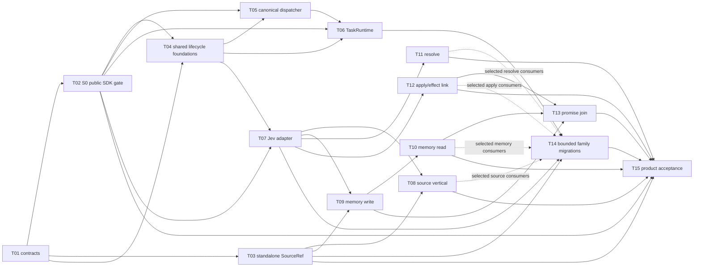

# Jev unified runtime execution ledger

The user's scoped follow-up is complete: writer-budget repair, final runtime build, type checks, 2209 extension cases and all 1608 current kernel/play-controller cases (verified segmented coverage). Source-publication crash/cancellation repairs are also verified. No reward play or semantic/performance acceptance was started. The next owner should use [the acceptance handoff](../handoff-jev-acceptance-20260920.md); [the earlier detailed handoff](../handoff-jev-unified-refactor-20260920.md) is historical context. Product acceptance and retirement remain open.

Status: **T01–T11 are accepted within their stated bounded gates. T12 finite fulfillment and base apply integration are implemented with conformance evidence; recovery is observed but full true-table acceptance remains open. T14 source-reference consumer migrations are implemented, with semantic/live gates still open. T15 owner joins are under active implementation; T13 promise/reward real-table join remains pending.**

Canonical design: `docs/specs/jev-unified-runtime-refactor.md` / parent #101.

Evidence audit: `docs/research/jev-unified-design-audit-20260919.md`.

Reviewed §122 field-level amendment draft for lead insertion: `.tmp/team-lead/jev-ticket-plan/contract-122.md`.

Historical source-reference issue: #100, retained only as evidence.
External integration dependencies: #92–#98 KIC and #99 pacing. #99 D4 core compatibility is complete for the accepted S2 boundary; full versioned Mod alignment and pacing A/B remain pending in S6/S7. This ledger does not duplicate #92–#98 or claim their broader work complete.

## Intent check

The user wants the unified Jev design divided into bounded implementation tickets and then implemented by task-appropriate models. Success is a dependency-correct queue with exclusive proposed ownership, measurable acceptance, explicit retirement/rollback gates, and a model allocation that reserves Astra for lead/core work. A hollow delivery would be one ticket per broad stage, a document-only “done,” or a plan that lets dependent work start before S0 proves the public SDK seam.

## Execution envelope

- Production implementation is TypeScript only. `kernel-ts/` is the only production kernel; no Python production path is restored.
- Parent #101 remains the sole normative architecture. Contract amendments land before corresponding implementation.
- S0 is the hard integration gate. No hybrid-dependent runtime/domain ticket becomes active until T02 passes.
- T03 SourceRef may proceed after T01 freezes contracts even if T02 is unresolved. It makes no hybrid-runtime claim.
- S4 base memory is independent of S3/PDF. T09/T10 must not wait for T08.
- Promise/reward end-to-end acceptance exists only at T13 after S4 memory and S5 canonical action/effect linkage both pass.
- #92–#98 KIC and #99 pacing remain owned integration dependencies/references. #99 D4 core compatibility passed for S2; full Mod alignment and pacing A/B remain S6/S7 work. The external issues are not copied into this backlog.
- No ticket authorizes push, package, release, restart, worktree cleanup, or history rewrite. The reviewed child tickets are published only in the repository-local Markdown tracker under `docs/specs/jev-unified-runtime-tickets/`; this turn does not publish new remote GitHub issues.
- Product acceptance uses the existing play driver, real host launcher, configured Grok Keeper, and the main session as the sole player, one natural line per turn. Fake Keeper/scripted-player evidence is invalid.
- Models are limited to `gpt-6-astra`, `gpt-5.6-sol`, `gpt-5.6-terra`, and later mechanical `gpt-5.6-luna`. Astra owns lead/core runtime/shared contracts/dispatcher/kernel writes.

## Dependency graph

T04 is a hybrid foundation and therefore waits for T02; T03 is the only deliberately standalone implementation slice. T08, T09, T11, and T12 may run as separate lanes after their shared prerequisites. T08 is conditional for T11/T12 only when new PDF material is actually required.

## Model roster

| Role | Model | Tickets |
| --- | --- | --- |
| Lead, S0, contracts, runtime, dispatcher, kernel writes, go/no-go | `gpt-6-astra` | T01–T06, T08–T12, final decision for T15 |
| Ordinary typed adapter and semantic family implementation | `gpt-5.6-sol` | T07, T14 semantic owner |
| Ordinary integration-test and acceptance orchestration | `gpt-5.6-terra` | T13, T15 evidence |
| Mechanical migrations after mappings are frozen and reviewed | `gpt-5.6-luna` | optional bounded sub-slices of T14 only |

No other model is authorized by this plan. Model assignment never widens a ticket's write set.

Core tickets may delegate only closed non-kernel helper or test paths: T01/T02/T03/T04/T06/T08/T10/T11 may use Terra for harnesses, host-only helpers, or tests; T05/T09/T12 may use Sol for fixtures, host-only helpers, or parity tests. Astra retains the contract, shared-runtime, dispatcher, and every `kernel-ts` write and integrates those helpers. For the completed S2 work, Terra was unavailable at dispatch and the bounded helper/review assignments actually ran on dispatch-pinned `gpt-5.6-sol` at high reasoning. This records actual execution without changing future ticket ownership. A helper cannot change the ticket's acceptance or retirement claim.

## Implementation precedent

- The Pi SDK documents `createAgentSession`, `customTools`, and `createAgentSessionRuntime(factory)`, including the need to rebind and re-subscribe around session lifecycle changes. The repository-pinned 0.85.1 implementation remains the actual authority for T02: <https://github.com/earendil-works/pi/blob/main/packages/coding-agent/docs/sdk.md>.
- TypeSafe's patterns support atomic same-state decisions and host code composition; they do not prove this product's guard preservation: <https://docs.typesafe.ai/patterns>.
- Anthropic's effective-agents guidance supports bounded orchestrator/evaluator loops driven by actual environmental feedback; it does not prove product correctness or speed: <https://www.anthropic.com/engineering/building-effective-agents>.

These precedents validate the proposed partition only. Guard preservation, real RPC integration, quality, cost, and latency remain ticket acceptance work; no general speed claim follows.

## Ticket ledger

| ID | Stage | Title | Status | Execution state | Depends on | Model | Draft |
| --- | --- | --- | --- | --- | --- | --- | --- |
| T01 | S0 | Freeze contracts and compatibility boundaries | `accepted` | Complete: compile + 10/10 contract tests | — | Astra; Terra test helper | `docs/specs/jev-unified-runtime-tickets/01-contract-freeze.md` |
| T02 | S0 | Prove public SDK seam and decide go/no-go | `accepted` | Complete S0 only: retained real Grok/Jev evidence + 49 focused conformance cases + independent GO review | T01 | Astra; Terra harness helper | `docs/specs/jev-unified-runtime-tickets/02-public-sdk-gate.md` |
| T03 | S1 | Standalone SourceRef resolver and legacy views | `accepted` | Complete standalone: typecheck + 9/9 tests + lead review; no consumer/hybrid claim | T01 | Astra; Terra test helper | `docs/specs/jev-unified-runtime-tickets/03-source-ref.md` |
| T04 | S1 | Version, read-set, budget, checkpoint and outcome foundations | `accepted` | Complete foundations only: Terra 10/10, combined 29/29, strict typecheck, independent GO | T01, T02 | Astra; Terra test helper | `docs/specs/jev-unified-runtime-tickets/04-task-foundations.md` |
| T05 | S1/S2 | Extract CanonicalOperationDispatcher | `accepted` | Complete dispatcher foundation: Sol 11/11, Terra RPC 4/4, combined 35/35, build/typechecks pass | T02, T04 | Astra; Sol parity-test helper | `docs/specs/jev-unified-runtime-tickets/05-dispatcher.md` |
| T06 | S2 | HostSessionAdapter and TaskRuntime lifecycle | `accepted` | Complete for S2 core + bounded read-only integration; live dependent and zero-Jev paths | T02, T04, T05 | Astra; Sol-high bounded helper/review | `docs/specs/jev-unified-runtime-tickets/06-task-runtime.md` |
| T07 | S2 | Pinned Jev DecisionAdapter and bounded transport | `accepted` | Complete for S2 core + bounded read-only integration; focused adapter 12/12 | T01, T02, T04; joint T06 gate | Sol-high | `docs/specs/jev-unified-runtime-tickets/07-jev-adapter.md` |
| T08 | S3 | Source lookup and proof vertical | `accepted` | Fresh v2 navigation + original-page readiness + distant clinic query; independent functional GO | T03, T05, T06, T07 | Astra; bounded host/test helper | `docs/specs/jev-unified-runtime-tickets/08-source-vertical.md` |
| T09 | S4 | Reference-first memory write/organize lifecycle | `accepted` | Source-ref publication, attribution/alias/consumer/recovery regressions + real v3 write/reader evidence; uncertain segments stay pending | T03, T04, T06, T07 | Astra; Sol host/test helper | `docs/specs/jev-unified-runtime-tickets/09-memory-write.md` |
| T10 | S4 | Adaptive memory read, recall and bounded context | `accepted` | V5 exact multiquestion originals and explicit partial coverage; independent GO | T03, T06, T07, T09 | Astra; Terra test helper | `docs/specs/jev-unified-runtime-tickets/10-memory-read.md` |
| T11 | S5 | Ordinary resolve exactly once through TS kernel | `accepted` | One real ordinary check, 22 domain / 6 public / 16 kernel cases and independent GO | T05, T06, T07; T08 conditional | Astra; Terra test helper | `docs/specs/jev-unified-runtime-tickets/11-resolve.md` |
| T12 | S5 | Atomic apply and canonical effect/fulfillment links | `in-progress` | Finite source-bound fulfillment conformance passes; two real clues settled and recovery delivered; movement exposed T15 owner gap | T05, T06, T07; T08 conditional | Astra; Sol test helper | `docs/specs/jev-unified-runtime-tickets/12-apply-effect-link.md` |
| T13 | S4/S5 join | Promise/reward vertical acceptance | `planned` | Inactive | T09, T10, T12 | Terra | `docs/specs/jev-unified-runtime-tickets/13-promise-join.md` |
| T14 | S6 | Migrate bounded text/audit/presentation families | `in-progress` | Audit, journal, presentation, guidance and setup references implemented; verifier quality and family live gates remain | T03, T05, T06, T07 plus actual consumers and #99 | Sol; Luna mechanical later | `docs/specs/jev-unified-runtime-tickets/14-family-migrations.md` |
| T15 | S7 | Migration, restart, performance and real-table acceptance | `in-progress` | Closing incumbent handoff, owned source publication, in-goal replan and nested provider budgets | all enabled-family gates | Terra evidence; Astra go/no-go | `docs/specs/jev-unified-runtime-tickets/15-product-acceptance.md` |

## Activation plan

1. T01 is accepted: §122 and `runtime/jev/contracts.ts` landed; compile and 10/10 contract tests passed.
2. T02 is accepted as the bounded source-only S0 gate; T03 remains independently accepted as a standalone compatibility slice. Neither acceptance implies full runtime/domain rollout.
3. T04/T05 foundations and the combined T06/T07 S2 gate are accepted within their explicit boundaries. The retained proof is `.coc/playtests/jev-s2-live-05-20260920/s2-evidence.json`; independent review is `.tmp/team-lead/jev-s2-gate-review.md`. It contains one dependent real read-only workflow plus one exact zero-Jev turn. Trials 01–04 remain adverse/partial evidence, and the reviewed credential-shape scan returned zero matches.
4. T09 passed its independent bounded GO in `.tmp/team-lead/jev-t09-core-review.md`: 19 referenced RPC / 15 legacy cases, 191 Jev cases at the reviewed gate, and retained live v3 write plus incumbent capsule-reader evidence. `.coc/playtests/jev-memory-live-03-20260920/memory-evidence.json` and `jev-memory-live-04-20260920/memory-reader-evidence.json` preserve the actual builds and limits. V1/V2 adverse rows and uncertain segments remain retained. T10 is accepted for bounded v5 semantic retrieval; T08 is also accepted at its bounded functional gate with fresh v2 setup and distant clinic query evidence; no speed claim. T11 is accepted for bounded ordinary resolve; T12 implementation and conformance are active. T09 does not imply adaptive retrieval, reward fulfillment, performance or product acceptance.
5. Run T13 only when T09, T10, and T12 have their own accepted evidence.
6. Split T14 into one selected consumer-family assignment at a time. Luna starts only after a closed inventory and approved mappings make a sub-slice mechanical.
7. Run T15 after all families selected for release have passed, #99 compatibility is evidenced, and any KIC-dependent claim has the relevant #92–#98 evidence.

## Completion rules

A ledger item moves to Done only when its draft's observable acceptance and retirement/rollback clauses pass. A path existing, a compilation succeeding, a model responding, or a synthetic fixture passing is never sufficient for S7. If T02 fails, T03 may remain an accepted standalone slice; T04–T15 stay inactive and the current launcher remains authoritative.

## Active ownership update (2026-09-20)

- Root Astra: T12 apply/options/fulfillment kernel, shared operation binding envelope and integration. The source-bound envelope, canonical fulfillment receipt owner, original-term catalog and shared readers are implemented; actual reward acceptance remains pending.
- Astra helper `audit_core`: T14 audit references/jobs/validator/capability, pure production speech-parser extraction and focused compatibility tests. This is a core-only assignment under the user's model instruction.
- Sol helper `t14_inventory`: T14 audit host submission/evidence/brief, narration-audit 1.2.30 package/prompt, host/prose tests. Post-delivery verifier implementation remains opt-in with quality gate pending.
- Sol domain/test helpers completed bounded T10 and T11; all original and adverse campaign evidence remains retained. No commit, stage, push, package or installed-App restart has occurred.

## Remaining integration audit gates

- T12 base apply v3 now settles two real briefing clues (live03, turn19) but the former 120-second absolute task deadline cancelled productive review before delivery; evidence must join retained receipts to recovery without repeating them. The host deadline is now a separately configured total ceiling; caller deadlines and idle/transport guards remain unchanged.
- Foreground read sets now pin each enabled nested policy version, not just the umbrella table domain. Saved decisions must not survive a memory/apply/fulfillment policy change unnoticed.
- S7 must audit foreground nested generative-owner token/cost attribution and hard-budget inheritance (source/Mod/presenter calls), plus writer budget on partial exhaustion. Current core role/decision accounting does not itself prove every legacy nested runner shares the full budget. No broad budget-conformance claim until this gate is checked.

## T15 closure work (2026-09-20)

Read-only owner audit `.tmp/team-lead/jev-t15-owner-audit.md` found four concrete joins. Root Astra owns exact incumbent handoff, attempt-scoped replanning and integration. Astra `fulfillment_catalog_core` owns operation-bound source publication/advance; Astra `audit_core` owns nested provider-budget enforcement. Sol `task_runtime_tests` owns independent public-SDK and lifecycle conformance. All share exclusive assigned paths with no commits.

Real recovery is retained in `.coc/playtests/jev-apply-live-04-20260920/apply-evidence.json`: turn20 delivered prior settled briefing without a repeated apply. Turn21 exposed unsupported catalog plus rejected replan; no move receipt exists despite the departure prose. This is adverse acceptance evidence and drives the owner closure, not a completed movement claim.

T14 setup-input references now pass 21 focused host/pure/real-kernel cases; all copy families have implementation paths. The full quality/live and versioned pacing gates remain pending.
