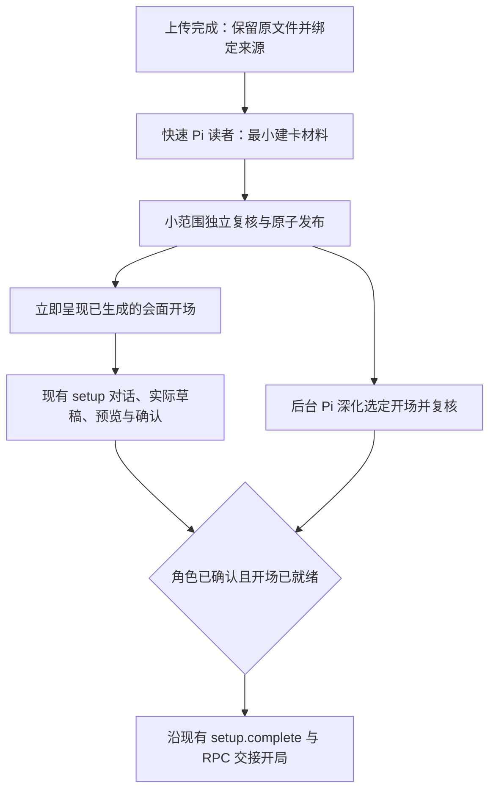

# PDF 上传后优先建卡、后台准备开场

状态：已实现并完成本次验收。2026-09-08。集成分支 `codex/fast-pdf-onboarding` 已整合主线及建卡成果；验收范围与性能限制见第 7 节。
范围：原 PDF → 模组感知建卡 → 同一会话开局；复用现有 Pi、ModuleGraph、setup 草稿与确认、宿主导入任务。

## 1. 目标与当前依据

上传完成后的短等待只用于取得建卡必需信息。玩家随后进行沉浸式建卡，开场图谱在后台准备；只有角色已确认、开场仍未就绪时才需要等待。

成功是玩家尽早回答第一个与模组有关的建卡问题，看到真实角色草稿，确认后直接衔接游戏。只把解析换成子进程、仍等完整开场后才允许建卡，不算完成。

设计依据的源码快照：

| 来源 | 已确认事实 |
| --- | --- |
| 主分支 `0.9.0a`，`91afbbeb` | `CocOnboardingHost` 已有持久导入任务和解析子进程；当前 UI 的建卡提交仍等待整个准备状态 ready |
| `codex/guidance-integration`，`a31b7167` | 已有沉浸式引导、真实草稿、预览、确认和本地化；worker 仍是 `reader.prepare → withGuidance` 串行，`converse` 要求 ready |
| 同一引导分支 | guidance 缓存键包含整份 `graphBytes`；后台图谱换代会使原引导缓存失效 |
| 宿主 | `children` 以导入 id 为键；后台 prepare 和前台 converse 并行后会争用同一槽位，旧回调还会保存过期的整个 job |
| Web 基座 | 每个 WSS 连接创建一个 backend；backend.close 会 dispose 解析任务，刷新页面可能停掉后台工作 |
| Workbench | 已声明/注册 overlay、statusBar，但 App 未挂载这些区域；普通 view 的受控接口没有像 SessionPanel 一样绑定当前 session |
| `0.8.2a` 只读参照 | `source_fast_facts` 提前区分有来源和未解决的信息；建卡简报只按公开输入计算摘要与缓存 |

实现前先整合并核对已有建卡成果。该分支文档写有“已整合”，但上述主分支快照没有相应实现；以实际源码和整合提交为准。本设计不重做建卡计算、角色确认或语言投影。

## 2. 选定流程



上传后立即登记后台准备任务；它等待快速材料的同一份起点，再开始语义图谱写入。无需让两个冷启动读者同时建立不同的场景/NPC 名册。并行重点是**玩家建卡与开场深化**。

快速材料未发布时，后台可复用文件校验、原生目录和页图缓存，不另做一次全书扫描。快速材料发布后，后台直接请求选定 opening，跳过已有材料覆盖的全局 skeleton 步骤。长本其他章节继续按需读取。

### 2.1 快速读者的职责

扩展现有 `module.read.*` 的 purpose，增加 `guidance`，沿用带 read/write/edit/bash 和私有 pdf 页图工具的 Pi 读者。它直接选原页，不经过 OCR、全文 Markdown 或完整开场图谱。

本次只读取足以确定以下内容的原页：

- 时代、地点、公开前提和玩家为何参与。
- 会影响建卡的必要限制；来源未说明与尚未查清必须区分。
- 选定的开场场景，以及会面人物的公开身份和可说的话。
- 模组相关的职业、训练、语言、普通装备和动机建议；建议不能冒充作者的强制要求。

读者自行使用原生目录、概述、调查员准备和开场页定位，不固定前 N 页、不按页切片扫全书。存在多个实质不同的入口且用户未选择、原文也未明确默认入口时，只提出一次有依据的开场选择；不能混用两个入口的时代或约束。

输出复用两种现有产物：

1. `draft.json`：现有图谱词表中的最小 module/scene/必要人物及关系、公开建卡事实和真实来源引用。`ready_nodes` 必须为空。
2. `guidance.json`：沿用 `{opening, advice, scene, guide, handoff}`。opening 是玩家语言中的短会面和第一个身份问题；advice/handoff 是英文内部材料。场景和人物须与最小图谱对应。

一位独立、带工具的 Pi 复核这份小材料，同时核对来源、关键建卡约束和泄密风险。复用已有 draft review 与 guidance review 的格式/检查，不再串行调用一次完整图谱作者、一次引导作者和两轮完整复核。复核覆盖绑定两份产物的摘要；任一文件被改动，旧复核不能授权发布。确有问题时保留原尝试并进行有界修正，不能用无来源简介赶时限。

`guidance` 的发布允许创建和确认调查员，**不产生任何可玩节点或 opening_ready**。图谱和引导先写入不可变文件；仅在两者检查通过后，更新现有 module 元数据的接受指针。半写入不可被读取为就绪。

### 2.2 不再重写已生成的第一个问题

accepted guidance 中的 opening 已经由模型生成并复核。准备好后直接沿现有主会话消息通道呈现它，同时启动/恢复 setup agent；无需再等 setup agent 把相同的会面改写一次。

复用 `setup.prologue` 记录这次会面，并以宿主生成的会话/序幕交付标识去重。首次展示、刷新和重连使用同一份文本；setup agent 接到玩家回答时已知道会面发生过。重放只能恢复缺失的交付，不能重新介绍、产生新角色或重复授予物品。

完整对话、真实数值草稿、修改、预览确认、卡片本地化沿用现有引导实现。所有数值仍由内核产生。

## 3. 各层的最小改动

### 3.1 来源与缓存：一份稳定的建卡材料

保留 `.coc/modules/<module>/character-guidance/<fingerprint>/accepted.json`，不增加另一套简报数据库。

- 查找键包含原 PDF 指纹、选定开场、语言、规则/职业目录版本和引导/复核版本。
- accepted 包含其公开事实及来源依据的摘要，指向对应的已接受最小图谱。
- **不再把整张图谱或全局 generation 放入引导缓存键。** 后台新增怪物、线索、结局不会让建卡重来。
- 同一模组/开场/语言的相同请求合并，预设与已解析模组直接使用可用的公开材料或接受缓存。
- 开始建卡时，campaign 固定本次接受指针与开场。后台只补充图谱，不替换进行中的引导；更换开场需显式选择，不能静默沿用另一时代的角色约束。
- 新来源证据若与已接受的关键事实矛盾，沿用来源冲突闸门并显示阻断，不能静默改角色或把错误开场标成 ready。

### 3.2 setup：只将“开局闸门”留在最后

内部区分 `setup_ready` 与 `opening_ready`。前者必须有已接受的公开材料、选定开场和引导；后者仍是该开场的现有可玩性/来源闸门。

- `prepare-module` 的建卡前置阶段以 `setup_ready` 为目标；同步修改 `steps.json`、恢复判断和 setup 扩展，不能只改 UI 按钮。
- `campaign.create` 可以根据已接受最小材料创建 setting_up 战役。新增可选 `start_scene`，由宿主传入本次选择，保存在已有 `opening_scene` 字段。
- 世界初始化使用该 campaign 的开场；仅有薄图谱时不初始化为可玩世界。`setup.draft/previewed/confirm/prologue` 不依赖完整开场就绪。
- `setup.prologue` 可验证薄图谱中的场景、人物和公开会面；它不等于开始剧情，不授予金钱、物品或线索。
- 确认角色仍提交已展示的同一版本，不重新生成。开场未好时，确认完成也必须被保留。
- `setup.complete` 保留完整角色、确认版本和**本 campaign 选定开场**的就绪检查。不能用共享 module 的另一个入口已就绪代替本入口。
- 只在进入游戏时，从当前已接受开场材料初始化完整世界；新增的开场 NPC 和事实不能因早期薄图谱而缺席。

现有模块默认开场可保留给旧调用者，但新前台将选择绑定在导入任务和 campaign 上。两个会话选择同一 PDF 的不同入口，不能通过修改全局 opening_choice 相互影响。

### 3.3 宿主：两个准备状态，共用一个导入任务

不新增通用任务调度平台。继续由 `CocOnboardingHost` 持有现有导入任务；将原先串行的 `prepare` 拆为内部 guidance 和 opening 两个目标。

建议的宿主状态投影：

```ts
type PreparationState = "queued" | "running" | "needs_choice" | "ready" | "paused" | "failed";
type ImportView = {
  id: string;
  name: string;
  source: { state: "uploading" | "bound" | "failed"; received: number; total: number };
  guidance: { state: PreparationState; stage?: string; candidates?: unknown[]; error?: string };
  opening: { state: PreparationState; stage?: string; done?: number; total?: number; activeReaders?: number; error?: string };
  character: { state: "not_started" | "conversing" | "draft" | "confirmed" };
  canConverse: boolean;
  canHandoff: boolean;
};
```

这是前台投影，不是四套存档：character 从现有 campaign.setup/draft/confirmation 读取；布尔值由宿主/内核推导。五段完整 guidance、内部路径、指纹和审阅材料不通过进度接口发给 UI。

现有 onboarding invoke 保持单入口：

- `begin/chunk/finish/select`：绑定来源并排程；finish 不等待模型完成。
- `status`：返回上述快照；原有 current_import 恢复该任务。
- `opening`：绑定入口并继续相应准备；已进入对话的入口不能被后台替换。
- `converse`：只要求 guidance ready；幂等创建/绑定 campaign 并进入既有 setup。
- `pause/resume`：增加 target `opening | all`，默认只控制长解析；不会撤销已生成的引导或角色。关闭/收起浮窗不调用 pause。
- `handoff`：复用完整性检查和原 RPC 交接；不是 UI 直接设置 ready。

修复并行必需的内部行为：

1. 长任务 child 按 `(import, purpose, attempt)` 管理；converse 等短操作和卡片展示不覆盖后台 child。
2. 所有完成/进度回调只更新自己负责的字段，在串行写入口合并最新 job；不用启动时捕获的旧对象覆盖整份 job。
3. 重试、暂停、入口变更增加宿主 attempt 标识；旧进程的迟到消息不能改新状态。取消一个目标不终止另一条已独立推进的路径。
4. 现有 busy 只保护短事务，不因长解析运行而拒绝 converse/确认。
5. 开场复核保留现有最多 40 并发的能力；快速来源阶段先完成共享起点，建卡对话和卡片展示随后独立于解析 worker 的排队。不得以解析 busy 阻止交互。当前信号量属于读者进程，不能宣称是跨进程的全应用限额；本次不新增通用调度器。实验比较背景并发 40/38 对前台响应的影响，再确定默认参数。无递归派生子读者。

### 3.4 真后台：解析的拥有者是应用进程

Web 当前每连接一个 backend，关闭 backend 会 dispose 解析。仅做浮窗无法改变这个生命周期。

将现有 `CocOnboardingHost` 放到 Web server/Electron main 的应用级拥有者中，按 repo/home/profile 隔离；通过依赖注入提供给连接级 backend。**只共享导入准备这一块**，其余会话 backend、事件流和租约维持原状。

- 连接断开只退订进度，不停止任务；切换会话、收起窗口和页面刷新亦如此。
- 应用退出才统一排空自有子进程并持久化 paused；本次不引入应用退出后仍运行的守护进程。
- 重启后读取现有 job/reader claim，按已证实的拥有者状态恢复；不能仅因超时就另起一份读取。
- 状态查询与控制仍验证原扩展权限和 session/campaign 绑定。共享拥有者不等于把所有会话任务信息公开给任意调用者。

与 [Asynchronous Request-Reply](https://learn.microsoft.com/en-us/azure/architecture/patterns/asynchronous-request-reply)
对照，任务接受、后台执行和状态查询分离适合这里；沿用当前 invoke/status 传输和本地文件，不引入其云队列或新 HTTP 接口。

### 3.5 开局合流只有一个拥有者

放行条件是：当前真实草稿已确认、同一选定开场已就绪、现有确认/开始意图有效。

角色先完成：保留确认结果，结束当前模型回合，显示“角色已准备好，开场仍在准备”；不让模型反复调用 complete 或重新建卡。

开场先完成：后台标记 ready，建卡继续；不提前触发守秘人开场。

两者完成：由宿主协调一次 `setup.complete`，在当前 setup 回合收束后，沿 `pipicoc/rpc.mjs` 的既有 setup → play 切换继续会面。需要补充一个内部的“就绪后重试交接”通知，不能依靠玩家再发一句话来唤醒，也不能增加一条合成玩家消息。

前台当前会话正在等待、且已有确认/开局意图时可自动接续。用户已经离开该会话时只记录就绪；返回后沿原意图恢复或提供开始入口。来源任务单独完成不能在后台推进剧情。

交接序幕、确认版本和首次开场都以已有持久标识去重。图谱 ready 回调、角色确认、重连同时到达，只允许一次交接。

### 3.6 预设剧本目录：上架是被声明的，不是被扫描出来的

`content/starters/` 是构建目录，不是货架。除了策展好的剧本，它同时装着规则靶场
（`mystery-house`，自己的 `setting_tags` 里就写着 `rule-gym`）和构建车道产出的对照本
（`the-haunting-rulebook`，与 `the-haunting` 同名，两条并列时玩家分不出差别）。目录扫描
把这些一并推到了玩家面前，并且只能拿开发用的文件夹 slug 当副标题。上架与否是产品决定，不是目录里有什么。

- 每个想上架的 starter 自带 `starter-listing.json`：`listed`、`order`，以及按游玩语言授权的
  `title` / `blurb`。没有这个文件、或 `listed` 不为 `true`，就不进玩家目录——默认关闭，
  以后往这个目录里落的构建产物不会自己漏出去。不上架的一方写明 `not_listed_reason`。
- 上架与否只是宿主的展示决定：内核的 starter 注册路径不变，`campaign.create {module: <id>}`
  仍然认所有 id，测试与规则工作不受影响。
- 标题和简介按 `play_language` 取；缺该语言时退到另一种已授权语言，再退到图谱模块节点的
  `name`。这些文本是授权内容，不在代码里做语言判断或翻译。
- 目录读取因此带上 `play_language`：`onboarding` 的 `catalog` 动作接受它，前端在游玩语言
  变更时重取一次。

## 4. 进度浮窗的扩展方式

本次只补通现有 `overlay` 位置，不顺带建设 statusBar 或新的任务中心。

- App 挂载通用 `WorkbenchRegion location="overlay"`；该位置展示启用扩展的 overlay views，并支持有序堆叠。
- 通用 view context 增加当前 sessionId；controlled loader 按 SessionPanel 的现有做法创建 session-bound api，不能用未绑定的 api 控制任务。
- PipiCOC 通过现有 manifest 的 viewContainers/views 注册 `coc.preparation`，其 entry 由扩展提供。
- 宿主提供受验证的进度快照。首版由扩展统一每 1–2 秒查询一次；CocOnboarding 与浮窗共享这一份前台状态，避免两套轮询。保留之后复用 subscribeExt 推送的空间，本次不同时增加第二套协议。
- 共享状态沿用当前 registry 的外部 store 订阅方式；相同状态返回稳定快照，按 [React 的订阅约定](https://react.dev/reference/react/useSyncExternalStore) 通知变化，不在每次渲染重新启动轮询。
- 浮窗在会话进入建卡对话后仍在；收起为小进度条，点开可看阶段、文件、暂停/继续或重试。
- 窄窗口用紧凑的顶部/底部条并可展开，避开输入框与角色确认控件；不抢焦点，不弹模态对话框。
- 上传显示实际字节；阅读显示正在进行的阶段；复核有真实分母才显示计数。未知工作量不伪造全书百分比或预计时间。
- 解析失败保留引导、草稿与确认；只重试失败目标。切走再回来重新查询当前状态，不恢复旧的“正在解析”截图。

与 [VS Code 后台进度](https://code.visualstudio.com/api/ux-guidelines/status-bar)
和 [Fluent 进度指示](https://fluent2.microsoft.design/components/web/react/core/progressbar/usage)
对照后，采用低打扰、可展开、阶段/真实计数的进度展示。通用区域负责容纳扩展，PipiCOC 负责任务内容和操作。

## 5. 分步实现与验证

| 切片 | 主要文件范围 | 独立退出条件 |
| --- | --- | --- |
| 1. 快速建卡材料 | `extensions/module/reading-service.ts`、`reader-review.ts`、`character-guidance.ts`；`kernel/coc/modules/*`；现有 setup/source 提示 | 原 PDF 的小材料经工具型 Pi 与独立复核发布；guide ready 而 opening 仍 false；后台换代不重建同一引导 |
| 2. 并行建卡与交接 | `pipicoc/onboarding-worker.ts`、`extensions/onboarding/*`、`content/setup/steps.json`；`kernel/coc/setup*.py` 与 campaign 初始化；`CocOnboardingHost`/backend | 慢开场期间完成真实草稿/预览/确认；opening ready 后一次交接，无二次建卡、无重复开场 |
| 3. 应用持有任务与浮窗 | Web server/Electron main 的拥有者接线、backend options；Workbench/controlled loader；PipiCOC manifest、进度 entry、安装脚本和 UI 状态 | 刷新/切会话/建卡对话期间任务继续；浮窗恢复真实状态、控制正确任务；应用退出可恢复 |
| 4. 真浏览器速度与体验 | 现有源码测试及浏览器验收目录 | 完整上传→第一建卡问题→真实草稿→确认→开局；两种完成顺序及暂停/重试都通过 |

每个切片先在 `docs/kernel-rpc.md` 写入对应接口形状和“内核的决定”，再实现。代码所有权应按上表明确分配；本设计阶段不发票、不合并分支、不改运行代码。

确定性回归至少覆盖：

- 源材料尚未满足关键建卡约束、复核未通过时不放行；guidance 不能授权游玩。
- 人物确认早于 opening ready，以及 opening ready 早于人物确认。
- 后台回调不丢失 campaign/confirmed revision；迟到回调不能恢复已取消 attempt。
- 刷新、切会话不取消准备；应用退出暂停；重连无重复读者、序幕或交接。
- 两个会话同一 PDF、不同入口的引导和最终 readiness 不串用。
- background graph generation 变化不使进行中的 guidance 或角色失效。
- 背景 worker 达到其并发预算时，建卡对话和卡片展示仍可独立启动，不被同一个 busy/child 槽位阻塞；另行记录真实模型并发下的前台响应。
- 开局前始终没有世界推进、奖励、钥匙或剧情线索的伪造收据；最新开场 NPC/材料在真正开始时齐全。

真实验收仍用用户提供的 Masks 长本、内置浏览器、Grok 4.6 low，主会话作唯一玩家。先做快速材料的真实小实验，再迁移生产流程；不以 mocked UI 或合成建卡替代实际体验。

记录四个独立时间点：上传确认完成、第一条可回答的建卡问题实际呈现、角色确认、首次游玩开场。主要指标是前两点的间隔，以及确认到开局的间隔；开场选择和人工思考时间单列。

性能目标先用于实验：Masks 至少三次新的语义缓存冷启动，争取每次在 60 秒内呈现建卡问题；已有接受缓存争取 2 秒内呈现已生成的问题。报告每次、中位数和最慢值，不从三个样本推断 p95。不能为了达标省掉关键事实核对或造一个通用开场。未达到目标时，在快读内容范围、重复模型调用和排队等待上优化后再定生产参数。

真实测试还要有一遍开场较慢时先确认角色、一遍缓存开场已好但玩家继续修改角色，验证真正的两边合流；并保留全部来源、模型请求、状态变化和截图证据。

## 6. 实施过程记录（2026-09-08）

- 在独立生命周期检出 `chatrpgv4-wt-fast-onboarding`、分支 `codex/fast-pdf-onboarding` 开发；整合提交 `af7a6f89` 引入已提交的建卡成果 `6fca4d32`，未吸收另一任务的脏文件。
- 已接通 guidance source shard、成对摘要复核、稳定接受缓存、campaign 开场绑定、薄图谱不初始化世界与最终 setup.complete 闸门。
- 已接通导入 guidance/opening 两阶段、应用级 Web 拥有者、短操作独立 child、最新字段合并、暂停恢复、Workbench overlay 与会话绑定。
- 浮窗和 onboarding 通过受能力控制的 `api.observe` 共享只读状态轮询（同 host/extension/session/query 一份）；没有新增网络协议或任务平台。当前会话的浮窗通过既有 extension invoke `setup-handoff` 通知空闲 setup 重试原完成闸门；不发送合成玩家消息。
- 初次直接首问使用持久 `coc-setup-opening` 条目和既有 presentation 流投影，记录 `setup.prologue`，不再启动一次模型改写。
- 内核完整测试：1116 passed、1 skipped，250.50 s。扩展首次全跑发现两项新增 review 测试回归（无 guidance 时多读了不需要的候选文件）和一次已有清理竞态；修正后相关 15 项已过。仍需最终扩展和 Electron 检查。
- 真来源实验 1：669 页 Masks，新语义缓存，478.226 s（read 428.154 s、review 49.601 s），15 张阅读图，6 页复核；格式修正往返与过多图像输入为已观察到的浪费。
- 优化职业目录为名称、薄材料 coverage 空对象、检查错误直接列合法词表、4 张历史页图窗口与每批少量选页后，实验 2：108.646 s（read 70.354 s、review 37.668 s），5 页阅读、3 页复核。尚未达到 60 s 实验目标。
- 浏览器第三份新缓存：read 73.793 s、review 32.146 s；发现上传检查后的 module_id 异步合并丢失，已修复，并支持原上传文件重试。其后发现首问已落盘却未投影、overlay 未进入 active plan，已修复，等待修复后的实际 UI 复验。该次不能作为完整上传到首问 UX 验收通过。
- 隔离浏览器服务为 5188；home `.coc/playtests/fast-onboarding-browser`。导入 `63f847ee-bff3-42e4-92ae-53ef825aae72`，会话 `4ae0443c-4a5c-451f-9c46-5815280838ae`，campaign `game-08d9be22-ed25-477d-be29-6c7972003327`。
- 浏览器刷新期间快读进程 PID 49567 和 attempt 保持不变；应用 SIGTERM 后 guidance ready、opening paused，已验证持久暂停。所有语义尝试、页图、逐字日志与原 PDF 均保留，不能删除。
- 该阶段尚待完成的项目由下节的最终记录结清；前述发现问题的运行保留为诊断证据，不作为无故障端到端验收。


## 7. 最终实现与验收

### 2026-09-08 冷启动优化切片

用户要上传后尽快开始有模组依据的建卡；成功是缩短真实冷启动首问等待，同时保留关键约束、正确入口和独立复核。仅把计时点提前、跳过复核或命中旧语义缓存不算成功。

已测瓶颈：快读 82.454 秒（6 次模型请求），复核 35.963 秒（5 次请求）；其中快读文件检查通过后仍等约 23 秒的最后回复与退出。

- 先把宿主已有的小任务、原生导航直接交给读者，把待复核的两份小产物直接交给复核者，省去只为读取这些输入的模型往返。选页仍由 agent 决定。
- 使用 Pi 0.85.1 原生 terminating tool result：submit_reading 写入/检查已有产物并结束该批工具调用；失败继续修正，支持先分次写文件再提交。保留工具 agent、原图读取、独立复核和全部发布闸门。
- 针对无效产物、未读引用、复核候选篡改、混合工具批次和取消跑回归；补宿主时间戳。完成后用同一 Masks、Grok 4.6 low、三个独立语义冷缓存样本记录来源准备时间，再用内置浏览器检查上传到可回答首问与后台 opening 并存。
- 不改全书解析策略、规则、角色创建或并发上限。60 秒仍是实测目标，不是承诺。

外部对照：[Anthropic 的 agent 实践](https://www.anthropic.com/engineering/building-effective-agents)指出串行分解会以延迟换取准确度；这里保留必要的独立核对，只去掉准备性往返。[OpenAI Agents SDK](https://openai.github.io/openai-agents-js/guides/tools/)支持工具结果结束运行，证明最后一次自然语言回复并非必要；本项目采用已安装 Pi 的同类公开接口，不引入该 SDK。Pi 的批次只有在所有结果都 terminating 时才结束，因此必须单独提交并验证真实行为。

实测证据保留于 `chatrpgv4-wt-guidance-latency/.coc/playtests/guidance-latency/`。五份来源实验和一份内置浏览器实验均使用原 669 页 PDF、独立语义缓存及 xai/grok-4.6 low；不复用旧接受材料，读者自己选页，复核者重新看图。

| 样本 | 快读 | 独立复核 | 结果 |
| --- | --- | --- | --- |
| 初步优化 trial-1 | 40.141 s | 19.774 s | 建卡材料准备共 60.939 s |
| 初步优化 trial-2 | 37.020 s | 9.793 s | 建卡材料准备共 47.784 s |
| 初步优化 trial-3 | 39.072 s | 19.507 s | 建卡材料准备共 59.373 s |
| 最终提示 trial-4 | 36.787 s | 11.115 s | 建卡材料准备共 48.672 s |
| 最终提示 trial-5 | 39.116 s | 13.573 s | 53.286 s 返回来源支持的秘鲁/纽约入口选择；不计为首问已出现 |
| 最终提示 browser | 45.611 s | 14.860 s | 上传文件选择到首问可见、输入可用 65.230 s；300 ms 轮询观察 |

最终提示的三个样本均为作者 3 次、复核者 2 次模型请求，原样本是 6+5 次。工具提交成功到 agent_settled 为 0.076–0.386 s；各阶段仍等待实际进程退出后才发布。初步样本中复核者有时先 write 再 submit，因此最终 brief 明确直接提交小对象。所有原始失败/选择分支保留，不能只挑最快的一轮声称达标。

最终三个样本的快读加复核耗时为 47.902 / 52.689 / 60.471 s，中位 52.689 s、最慢 60.471 s；这是来源阶段，包含一个入口选择样本，不是三个首问首帧。历史比较样本是 118.417 s，非同期随机 A/B。浏览器已完成上传、首问回答、后台解析并行和真实角色草稿可视化；后台随后通过 UI 暂停，所有状态保留。本次不重复完整章节验收。60 秒的前台冷启动目标仍未稳定达到。

回归覆盖无效文件、未观察引用、候选篡改、负面复核、取消和 Pi 的单独/混合 terminating 批次。全量内核及 play 测试 1140 passed、1 skipped（253.58 s），扩展 137 passed；最后的提交工具与复核专项 8 passed。Web 构建通过；浏览器保留 first-question.png、setup-response.png、investigator-draft.png、browser-timing.json。初始 Web 主机存在 browser unavailable 控制台条目（上传前发生，未修改该无关能力）。本次未改 Electron 源码或打包 App。

### 前一轮集成与验收（保留记录）

最终实现提交 `00156e46`、`c4e3f1a1`；已整合主线 `1a322fe7`，冲突解决提交 `6c823fd6` 同时保留紧凑角色卡、可展开计算依据、财务与物品分离，以及本次异步展示、自检和交接。

已验证的产品行为：

- 原 PDF 的快速引导通过独立工具型 Pi 复核后进入建卡，opening 继续后台准备。两者发布到同一 ModuleGraph，guidance 的 ready_nodes 为空。
- 页面刷新保持同一快读进程与 attempt；应用关闭将自身解析标记 paused。收起浮窗不暂停解析，恢复直接接上保留的读取成果。
- 在开场尚未完成时确认角色，确认版本、来源和会面均保留；准备完成后沿既有 setup.complete 与 RPC 启动器进入游戏。
- 开场已就绪时仍可修改角色；修改保留属性骰，最终确认同一真实预览版本。缓存新局自动衔接利马餐厅，未重新询问身份，随后完成一个真实调查互动回合。
- 首问直接作为公开会话消息投递，无额外 setup 模型改写。最新历史的分页参数为跳过条数 0；启动同步与此读回行为有专门回归。
- 独立展示任务不占用 30 秒 Web RPC 等待窗口；前端查询同一任务直到就绪，再确认预览。模型写坏 JSON 时使用相同验证器自检并定向修正，保留原输出。
- 旧导入任务按旧 ready/guidance/created 状态惰性投影，查询不改文件；旧战役与确认不会被重建。
- 不同入口绑定在 campaign 上；歧义入口先发布可选骨架，未选择时不授权建卡。已接受引导不因其他图谱材料更新失效。

性能为实际结果，不是达标声明：

| 验证 | 结果 |
| --- | --- |
| 优化后工具型快读 + 独立复核 | 冷缓存试验约 106–119 秒；最初试验为 478 秒 |
| 最终冷上传样本 | 上传起点 09:49:55.546 UTC；来源绑定 09:49:56.897；首问落盘 09:51:58.548（绑定后 121.651 秒） |
| 首问浏览器观察 | 09:52:22.358 UTC 已显示且输入框可用；这是观察上界，不冒充精确首帧时间 |
| 复用已解析剧本 | 从点击选择到可输入首问实测 2.833 秒 |
| 模型与方式 | xai/grok-4.6，low；全部文本结构化工作使用带工具 Pi，来源复核独立进行 |

**60 秒冷启动及 2 秒缓存目标尚未达到。** 保留 40 的复核容量；本书当前开场复核单元少于 38，未把相同实际并发的 40/38 配置称作有效对照实验。本次没有宣称重玩完整章节：验证范围是来源准备、真实建卡/修改/确认、两种完成顺序、自动开场和后续真实互动。之前的章节玩测证据完整保留。

自动化检查：内核与 play 套件 1119 passed、1 skipped；扩展完整串行检查 130 passed；集成后的角色卡/侧栏/宿主重点检查 40 passed；Electron 套件保持 197 个原有已知失败，0 个新增。独立检出缺失的 electron-vite 依赖使用已有安装的只读链接补齐，未改锁文件或手写失败基线。

真实证据在工作检出的 `.coc/playtests/fast-onboarding-verified/`，其中 `acceptance-summary.json` 记录来源指纹、冷/热时间、导入任务与战役身份。`first-question.png`、`revised-card.png`、`warm-card.png`、`warm-automatic-opening.png` 保留前台证据。角色先确认的暂停/恢复证据在 `.coc/playtests/fast-onboarding-browser/`。其余试验目录与全部原 PDF、页图、读取/复核请求和会话逐字稿都保留，不删除或改写为新的验收。

收尾时将工作树保留为证据与验收运行环境；主检出的并行文档改动保留，不吸收进本次实现提交。


## 2026-09-09: Confirmed character to playable opening

User-authorized follow-up: reduce the wait after character confirmation. Guidance speed is not
the target. Worktree: codex/pdf-opening-latency, base 96fa98b8. Edit source/review/reading helpers,
opening checks and focused tests only; preserve concurrent main-branch panel edits and all evidence.

- [x] Group independent reviews by shared source pages and reuse successful exact-input evidence.
- [x] Enforce a first-scene opening batch, checked submission and deferred optional material.
- [x] Reuse bounded PDF documents and coalesce repeated page work.
- [x] Run focused gates, local PDF A/B and a real Pi source-preparation probe.
- [x] Verify the packaged App in an isolated profile with Item Enhancement disabled. Observed confirmation-message to playable-opening interval: 105 seconds; source readiness preceded confirmation.
- [x] Integrate without absorbing concurrent work; retain the owned worktree for immutable preparation evidence and the previous signed App.

Existing PDF.js document lifecycle APIs support document reuse until cleanup/destroy; the owner
must not destroy active rendering ([PDF.js](https://mozilla.github.io/pdf.js/api/draft/module-pdfjsLib-PDFDocumentProxy.html)).
Bazel action caching binds results to inputs and execution context; this supports exact-input
review reuse, not trusting a filename or a previous positive verdict after the draft changes
([Bazel](https://bazel.googlesource.com/bazel/+/refs/heads/staging/src/main/java/com/google/devtools/build/lib/remote/README.md)).
xAI concurrency remains bounded by provider throughput, so this work reduces repeated calls
before increasing fan-out ([xAI](https://docs.x.ai/developers/advanced-api-usage/async)).

Real source probe: the first per-reader 180-second test deadline interrupted a draft; the retained repair completed, and 16 grouped reviews ran successfully, but publication rejected a decorated opening name that no longer matched task.focus. Added pre-review identity validation using the current kernel scene-handle/normalization implementation. This prevents expensive review of a batch that cannot bind to the selected opening. No source facts or campaign state were manually repaired.

Implementation checks: 50 focused extension tests passed; kernel and touched-host TypeScript checks passed. A retained Masks draft goes from 36 individual review jobs to 19 bounded page groups with no lost required pointers. Cache tests cover failure-only retry, changed candidate/source/version, modified original proof and unavailable advisory cache. The opening checker uses the existing kernel identity implementation, requires the first scene and its present NPC/discoverable material to be ready, and leaves final source publication gates intact. Small task/draft inputs are inlined to avoid redundant model read calls; opening submission runs the checker itself rather than asking for both a bash check and submit.

Local PDF A/B, one four-page sample (59–62, 2000px JPEG): cold source pages 2909.29→2140.59 ms, two cache passes 156.76→7.00 and 148.56→9.16 ms. PDF and image hashes match. This is local source work, not end-to-end latency.

Real source-only probe: first attempt used an overly short 180-second per-reader test deadline, then repaired its retained draft; 16 review groups completed but an opening-name mismatch rejected publication. The resumed attempt after early identity validation reached opening_ready in 279225 ms with 15 review groups. This is warm recovery, not a cold benchmark or App play acceptance. The subsequent present-material guard and inline-input refinements have focused coverage but were not counted as another paid full preparation run. Evidence remains under .coc/playtests/pdf-opening-latency-live/.

### Installed App result (2026-09-10)

Implementation integrated as 1e999a55; canonical /Applications/PipiCOC.app built from
b487f350, including the already-committed Mod pool change. PipiUI Dev signature and
managed runtime checks passed. LaunchServices and Spotlight resolve only the canonical
App; the original bundle remains in the task worktree's .build.noindex backup.

A sidebar project did not isolate the COC home, so the first UI attempt was preserved
and stopped before any card input or Mod toggle. The subsequent test used the product's
existing PIPIUI_PRODUCT_CONFIG override with a separate userDataDirname, not a code patch.
Only the existing xAI credential was reused locally; credentials are absent from reports.
Item Enhancement 1.1.3 was disabled before import and confirmed disabled in the actual
new campaign. The normal profile's Mod settings were untouched.

Observed fresh-profile source timing: guidance 04:50:23–04:51:51 UTC (88 s), opening
04:51:51–04:56:24 (273 s), overlapping genuine card creation. The player sent card
confirmation at 04:56:55; an actual playable opening was observed at 04:58:40 (105 s).
Source readiness was already satisfied 31 s before confirmation. The first natural
provenance question settled at 04:59:31 into round 2 using lookup/apply/narrate, with no
needs-material or Item Enhancement generation wait. Its exact click instant was not
separately sampled; do not infer an exact first-turn duration. Normal profile restored.

This is one genuine App run, not a matched cold latency A/B or a guarantee of instant
opening. Remaining post-confirmation delay belongs to confirmation/handoff/opening
work and observation overhead, not outstanding PDF source preparation in this run.
Evidence: .coc/playtests/pdf-opening-app-20260910/isolated-run-report.md and
.coc/playtests/pdf-opening-latency-20260910/. All failed attempts remain retained.

## 2026-09-10: Immediate scene prefetch and bounded background concurrency

Approved scope: wake queued adjacent-scene reading before the end of the Keeper response;
allow two background scene jobs while reserving foreground job and child-process capacity.
No two-hop prediction, scene-content changes, Python restoration or new daemon is in scope.
Worktree codex/scene-prefetch, base d114d0eb; concurrent primary card/Mod edits are untouched.

- [x] Immediate wake on table binding, queued scene movement and committed turns; no lost drain wakeups.
- [x] Two background jobs plus a foreground slot; foreground-priority child budget and local promotion.
- [x] Merged-source focused tests: 41 passed, including real TS multi-client leases. Kernel type check passed. The broader host comparison retained seven pre-existing diagnostics, with no new diagnostics.
- [x] Integrated and installed signed standalone arm64 candidate cc582f64 at /Applications/PipiCOC.app. Its stable signing requirement matches the previous package.
- [x] Visible App check reached round 4 in the museum, with the restaurant-to-museum movement receipt, NPC narration and normal composer. The ordinary profile was restored without player input. Worktree classified retained:locked to preserve playtest evidence and the previous installed App backup.

Installed-App evidence: the isolated profile retained Item Enhancement disabled. Reader-ready
wake occurred at 06:07:23.174Z, before turn-committed at 06:07:49.545Z. The first museum
travel request stayed at the restaurant because the Keeper kept the museum closed that night.
Normal composer was observed within 87 seconds; that is an observation upper bound.
The next natural rest-and-travel request crossed 180 seconds without cancellation, with an
explicit model request timeout and automatic recovery. Recovery asked a new museum-specific
NPC question beyond the completed generic scene prefetch. The resulting foreground job began
after 195 ms of queueing, read for 69.259 seconds, and ran two reviews concurrently in 17.131
and 18.237 seconds. Narration committed at 06:17:34.906Z. This proves prompt foreground
dispatch and preserved source review; it does not prove zero-wait scene transitions or faster
provider responses. No cold whole-document speedup claim is supported by this cached-module run.
Evidence is retained in .coc/playtests/scene-prefetch-20260910/ in both the primary and scene-prefetch worktrees. The test establishes actual arrival and working dispatch, not a seamless-latency result: the model timeout and the additional exact-question read remain visible limitations. No further test turns were sent.

The design follows bounded concurrent requests ([xAI](https://docs.x.ai/developers/advanced-api-usage/async))
and separate resource budgets for lower-priority work ([Microsoft bulkhead pattern](https://learn.microsoft.com/azure/architecture/patterns/bulkhead)).
These support capacity reservation, not an assumed linear speedup or a global provider-rate guarantee.

## 2026-09-10: Correct same-name scene material readiness

The next investigation corrected the earlier interpretation of the museum wait: a prepared scene and an unready location shared the same short handle. Scene/exit/apply projections incorrectly combined their readiness and told the Keeper material was missing; the apply preflight could also skip that ambiguous name. Readiness now uses the canonical node selected by the operation kind, while source requests retain their semantic focus for cache/prefetch reuse. Published content and the genuine missing-material gate remain authoritative.

The installed cc582f64 kernel fails both regression cases (false missing for the prepared scene, and allowing the inverse unread scene); the fixed native TS RPC passes. The focused related run passes125 tests and the kernel type check. Evidence: .coc/playtests/scene-material-latency-20260910/report.md. This is a regression repair, not a new cold-PDF or whole-turn latency A/B.

The prior UI transcript establishes479.028s submit-to-final time, including300.007s until provider timeout,87.904s source lookup,30.539s narrate and10.172s post-narrate model tail. It does not identify the upstream cause of the timeout. New provider request/response-header timestamps support a subsequent diagnosis; timeout/retry policy is unchanged, as described in docs/pi-host-contract.md. Merged candidate62039c9f passes134 focused tests and kernel types. It is installed as the signed canonical /Applications/PipiCOC.app; the two regressions also pass against that installed kernel. The ordinary campaign was restored without new player input, with a single canonical LaunchServices/Spotlight registration. No new paid Keeper playthrough or whole-turn A/B was run. The worktree and branch are terminal retained:locked to preserve regression evidence and the previous signed App backup.
