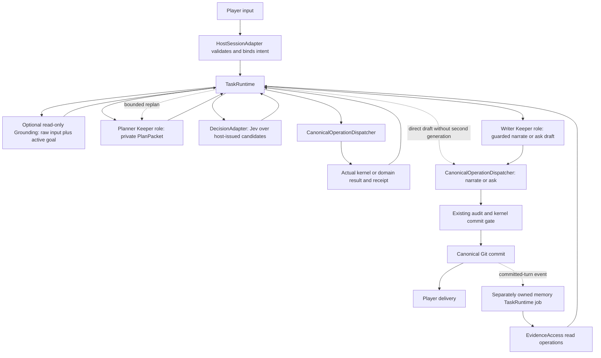
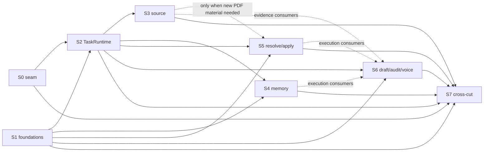

# Jev unified runtime refactor

Status: **Staged implementation in progress; not product-accepted.** T01–T09, including bounded T09 referenced-memory write/incumbent-reader integration are accepted. Retained real evidence includes dependent read-only and zero-Jev paths, original-PDF clinic consultation, and exact attributed memory flowing through the existing capsule into ordinary delivery. T08 is accepted within its functional source boundary; Bounded T10 adaptive memory read and T11 ordinary resolve are accepted. T14 post-delivery verifier implementation is under review; broader SourceRef consumer closure remains open. T12 base apply and source-bound fulfillment are active. Mutation-domain rollout, broader consumer migration, reward fulfillment, product/performance and pacing A/B acceptance remain open. #99 D4 core compatibility is complete for S2; full versioned Mod alignment and pacing A/B remain S6/S7 work. Follow the [execution ledger](../active-plans/jev-unified-runtime.md), [local tickets](jev-unified-runtime-tickets/manifest.json), and kernel contract §122.

This is the one authoritative master design. It supersedes the separate source-reference proposal and the earlier tool-task proposal as independent executable architectures; those remain historical evidence only. Tracker: [#101](https://github.com/Leehow/chatrpgv4/issues/101). A [companion non-normative audit](../research/jev-unified-design-audit-20260919.md) records conflicts, source pointers, and prototype evidence. Local prototype READMEs: [rule routing](../../.pi/prototypes/jev-rule-routing-20260919/README.md), [PDF routing](../../.pi/prototypes/jev-pdf-routing-20260919/README.md), [lean graph](../../.pi/prototypes/jev-lean-graph-20260919/README.md).

## Problem Statement

Players and operators absorb several distinct failures that the product has been treating as separate problems, so each fix risks contradicting the next.

First, models are still asked to copy existing prose, record fields, names, identifiers, and unchanged values to prove attention. A miscopied quote, a splice between duplicate strings, or a retyped digest can block a valid turn or hide the real semantic issue. The host should own exact extraction from pinned sources, and the model should decide meaning or select among host-offered candidates instead of reproducing text.

Second, preparation is both slow and eager. Source and adaptation work run multi-step generative readers and reviewers. Ordinary module lookup searches registered graph entities; an unfamiliar late-book subject needs separate source discovery, which can leave the player waiting before a graph identity exists. Exact reads are cheap, but broad discovery and repeated classification are expensive, and eager preparation of unrelated parameters does not help the current action.

Third, two overlapping proposals target the same seam: a source-reference proposal for host-issued page/span/field selection and a tool-task proposal for adaptive Jev loops and memory. They had already explicitly agreed to share one SourceRef, so they did not necessarily create independent parallel stores; they still lacked one complete global and nested owner, read-set, and budget contract. There must be one authority, one runtime, one dispatcher, and one reference contract.

Fourth, the current Pi agent loop normally requests an LLM after tools, so per-tool loops alone cannot remove outer roundtrips. A single bounded objective that needs several dependent mechanical steps should complete inside one tool task rather than returning to the Keeper between each step.

Fifth, current memory is generative and narrow-candidate-based, and relationship and promise AUTO-SUPERSESSION groups by subject and entities while the fulfillment link is missing. That can hide two independent promises from one NPC to the same party, and the lack of a guard is a risk that a one-time reward could be paid twice after restart; a double payout is a risk from the missing guard, not an observed user campaign failure.

Sixth, the source-readiness story contains real tensions: text-only Jev cannot replace visual proof, thin identity profiles must not become fabricated stats, missing facts must not become default zeros, and a global failure policy would be wrong because each domain needs different outage behavior.

Seventh, authorization and pacing are easy to blur into machinery. Probabilistic relevance is not player consent; completing an existing goal never authorizes a new goal, method, cost, or route; and no "progress debt" or `recovery_owed` hard gate should be revived to justify quiet play.

The design goal is therefore one coherent cognition and authority model, one host runtime that owns lifecycle, one guarded execution seam, one shared source-reference contract, one full memory lifecycle, and a staged gate sequence that front-loads the genuine integration risk instead of claiming it solved.

## Solution

The solution is a role division, one runtime, and one guarded seam, described here at overview level; binding contracts and the state machine live under Implementation Decisions.

- The configured **Keeper LLM** owns bounded macroplanning, replanning, novel interpretation, and actual player-facing narrative. Existing scoped generative owners may still author source interpretation, presentation or translation, profiles, voice, or optional derived summaries through tool-enabled Pi; they are bounded tasks under one TaskRuntime, not multiple autonomous Keepers. Model pins are unchanged except for the explicit Jev capability.
- **Jev** is typed semantic policy. It selects the next actions, evidence targets, and candidate arguments from host-issued closed sets, judges coverage and relations, classifies semantic dimensions, and returns typed Score and Noul telemetry. It never invents unbound game values; a typed numeric score or confidence is expected output. It never generates text, offsets, identifiers, URLs, or world state.
- The host **TaskRuntime** owns actual execution and lifecycle: task state, budgets, cancellation, checkpointing, trace, and result binding.
- The current **TypeScript kernel** owns deterministic legality, arithmetic, RNG, world state, and receipts. Semantic admission remains its domain and host-gated model judgment, not a deterministic kernel rule.

The role division is explicit, and the host runtime is not described as a cognitive agent. LLM plans and Jev decisions are proposals. Neither is consent and neither is a fact. Player goals are authored by the player; completing an existing goal never authorizes a new goal, method, cost, or route. The existing decision-boundary glossary is authoritative: a genuine player decision exists when there is enough public context plus a materially new unselected choice, or when a selected goal is complete. No mandatory new receipt, event, or question is required to justify quiet play. No `progress debt` or `recovery_owed` hard gate is revived; the pending Keeper-pacing design is integrated as required compatibility through its own owner, not as another planner.

There is one TaskRuntime, not separate global, per-tool, and memory agent controllers. Root turn tasks, delegated domain subtasks, and background memory jobs share lifecycle, cancellation, and trace rules, not one signal or budget instance. Domain modules still own their allowed operations, question families, completion conditions, and failure authority; sharing plumbing must not make domain legality generic. Child tasks carry parent deadline and scope and a real priority; they cannot reset budget or recursively spawn unbounded work. Existing runtime, source queue, memory queue, and continuation/checkpoint facilities are reused. There is no generic workflow DSL and no second agent framework. New necessary PlanPacket, TaskContext, and reference metadata are introduced; no duplicate canonical world identity, store, or framework is introduced, and existing object and NPC identities are preserved. Exact cheap reads finish with zero Jev calls.

One **CanonicalOperationDispatcher** is the single guarded execution seam. Both ordinary Pi tool calls and Jev-chosen operations pass through it. It extracts and reuses the complete existing tool preflight and call-state guards, admission, preparation, material readiness, kernel invocation, idempotency, post bookkeeping, trace, and delivery termination. Classified read primitives stay read-only. Mutating operations serialize under the existing campaign and kernel ordering and a whole apply batch is atomic; independent reads over a fixed snapshot may run in parallel. A root task may cross look, lookup, recall, resolve, and apply only inside its validated scope; a lookup-answer child cannot escalate to apply merely because that would help. Child operation results cannot trigger hidden new Keeper turns.

### Main flow

Player input enters through a host snapshot and IntentBinding. Optionally, before planning, a read-only grounding pass uses the exact raw player input and the existing active goal as its bounded retrieval objective, reusing capsule/KIC/EvidenceAccess and Jev memory and evidence selection when needed; it is not a separate planner agent, it does not need a prior PlanPacket, and there is no world mutation while grounding. A valid exact or cached context may skip it, and a later plan may request more grounding from a new hypothesis.

The Keeper role returns either a private typed PlanPacket or, for a simple turn, a direct delivery draft. The host validates the plan, Jev decides over host-issued candidates, the dispatcher executes the chosen canonical operation, and a real ObservationPacket is appended. Jev loops over further decisions until the task reaches a terminal or pending outcome, producing a TaskResult. The Keeper then writes final prose or performs a bounded replan; delivery uses the existing narrate/ask path and canonical Git commit.

Ordinary same-state questions may be asked in parallel because they share fixed state. Any answer that depends on a new observation waits for the next request; the host never pretends one question sees a sibling's answer. Multiple Jev calls per tool or root turn are allowed. The root Keeper may produce a direct draft for a simple turn rather than forcing two LLM calls. Replanning receives the remaining goal and the actual completed receipts and never replays settled steps. A pending genuine player choice stops the task. A genuinely new hypothesis or new text goes to the existing LLM owner only for that gap.

### Architecture

The TaskRuntime drives every phase. The planner and writer are Keeper-role lanes; Jev answers only through the decision adapter; every Jev-chosen operation and every ordinary tool call routes through the canonical dispatcher and returns its actual result, with receipts only for operations that produce them, before the runtime continues. No Jev decision bypasses the dispatcher. The direct simple-draft path lets a planner packet become a guarded draft without a decider pass, and a bounded replan returns only the remaining goal and completed receipts to the planner. Only a committed-turn event feeds the memory task, which the TaskRuntime owns, and no background memory job starts before the commit. Read operations may consult EvidenceAccess. The host performs PDF text and page-image reading; the TypeScript kernel executes rules, arithmetic, RNG, state, and receipts and does not parse PDF.

## User Stories

1. As a player, I want narration reviews to preserve exact adverse excerpts and unchanged document text byte-for-byte, so that valid repairs and clue wording are not lost to quote typos or paraphrase.
2. As a player, I want a supported opening to start without a full-document deep-read, so that the first turn is not blocked by unused preparation.
3. As a player, I want the table to search the whole document for a late-book location, so that an oddly labeled clue is not missed.
4. As a player, I want a clinic-hours question answered from source, so that I get a real answer without invented campaign state.
5. As a player, I want ordinary conversation to use minimal private narrative material, so that a scene works without a full stat block.
6. As a player, I want a rule operation to use only the parameters it needs, so that unrelated subsystems are not fabricated.
7. As a player, I want unsupported combat or chase actions to stay on existing handling, so that partial bindings never produce fake mechanics.
8. As a player, I want UNKNOWN to mean unknown, so that a missing stat is never silently treated as zero or ready.
9. As a player, I want one bounded tool call to finish a goal needing several dependent steps, so that I do not experience repeated Keeper roundtrips.
10. As a player, I want resolve and apply to settle exactly once after a lost reply, so that a roll or mutation is never repeated.
11. As a player, I want a genuine choice such as defense, luck, push, or spend to stop for me, so that the system never chooses on my behalf.
12. As a player, I want a quiet turn with no new decision to be accepted without a manufactured question, so that pacing is not machinery.
13. As a player, I want the table to recall an old non-module promise using different wording, so that established fiction is honored.
14. As a player, I want a promised reward paid exactly once, so that a restart cannot duplicate a one-time effect.
15. As a player, I want two independent promises from one NPC to coexist, so that one does not hide the other.
16. As a player, I want partial payment not to close a whole promise, so that remaining obligation is preserved.
17. As a Keeper operator, I want whole-document indexing without a semantic deep-read, so that navigation improves without blocking play.
18. As a Keeper operator, I want sparse and scanned pages flagged unknown, so that the system does not claim it read them.
19. As a Keeper operator, I want page roles as routing hints only, so that a multi-label page is never hard-excluded.
20. As a Keeper operator, I want Keeper-private retrieval separated from public admission, so that private facts never influence consent.
21. As a Keeper, I want a missing MRI or other absent fact to stay unsupported, so that the system does not hallucinate evidence.
22. As a Keeper, I want final context bounded and honest about omissions, so that I do not read a misleading completeness claim.
23. As a Keeper, I want the loop to adapt to real observations, so that a later step can build on a fact fetched earlier.
24. As a Keeper, I want a task to stop or reroute when it makes no progress, so that unproductive work cannot run up time and cost.
25. As a Keeper, I want a private PlanPacket handoff that ties each step to the active goal and read set, so that a plan cannot silently widen scope.
26. As an adapter maintainer, I want SDK session new, resume, and fork to rebind the adapter, so that restart never reuses stale state.
27. As a rules maintainer, I want eligibility from the current scene and public facts and independent rule, skill, check-needed, and slot fan-out, so that rule families are auditable and one missing fact does not corrupt others.
28. As a rules maintainer, I want mechanics readiness operation-specific, so that no unused Boolean bag claims readiness.
29. As a continuity auditor, I want to identify a candidate claim by source segment, so that duplicate text is not bound to the first occurrence.
30. As a memory maintainer, I want duplicate, reinforcement, independent, correction, contradiction, and temporal relations distinguished, so that history is not collapsed.
31. As a memory maintainer, I want more than twelve worthy segments processed or honestly deferred, so that the thirteenth fact is not discarded.
32. As a memory maintainer, I want same-job replay idempotent and old schemas readable, so that restart cannot duplicate or lose history.
33. As a source auditor, I want normalization to create a derivative, so that pinned native text remains provable.
34. As a source auditor, I want a reference to prove provenance only, so that location is not confused with interpretation or visual proof.
35. As a security reviewer, I want foreign and opaque model-authored references rejected, so that selections cannot cross campaign boundaries.
36. As an adapter maintainer, I want a pinned model and a common absolute caller deadline, so that optional work cannot silently become seconds.
37. As an operator, I want Jev optional, so that an unconfigured table reuses the incumbent or an existing unavailable result.
38. As an operator, I want admission to never fail open, so that faster preparation never weakens safety.
39. As a maintainer, I want each migrated family to remove its old unconditional generative work, so that the measured foreground slice actually shrinks.
40. As a tester, I want the real Grok table with the main session as sole player, so that acceptance is genuine and never a fake Keeper loop.

## Implementation Decisions

All decisions below are design commitments. They bind producers, readers, actors, and rollback. No slice is "done" if a producer, reader, actor, legacy path decision, or rollback is missing.

### Host session and Pi integration

The chosen route is the public SDK host seam, not a private Pi patch and not a CLI flag. S0 must verify role message handling and delivery visibility, auth, model selection, session new/resume/fork factory rebind, cancellation, actual Jev usage against the Keeper context budget, no Grok misattribution, canonical dispatcher invocation, and the real JSONL/RPC method surface. The low-level `streamFn` is available evidence, not an already implemented Jev native generative adapter. The private planner/task artifact uses one configured Keeper role and bounded existing role tools, not an eighth global gameplay verb. The host does not hide an implementation choice as a guaranteed public API. Unknowns stay specific and front-loaded; S0 stops before dependent domain rollout if the seam does not work.

### Deep modules

- **HostSessionAdapter**: validates snapshots, binds intent, owns the SDK session lifecycle and RPC seam.
- **TaskRuntime**: owns task state, deadlines, cancellation, checkpointing, trace, result binding, and the phase state machine.
- **Planner and Writer Keeper roles**: private typed PlanPacket and guarded narrate/ask draft.
- **DecisionAdapter**: presents host-issued closed sets to Jev and binds typed answers; typed answers do not inherently execute anything.
- **CanonicalOperationDispatcher**: the single guarded execution seam described above.
- **EvidenceAccess**: read-only source and memory access used by grounding, lookup, recall, and the post-commit memory job.
- **Memory lifecycle**, **source proof classes**, and **domain modules** per their contracts below.

Domain modules keep their own allowed operations, question families, completion conditions, and failure authority; only plumbing and lifecycle rules are shared. Same-TaskRuntime means shared lifecycle rules, not all jobs sharing one budget instance. A foreground child task inherits the parent deadline, cancellation, and scope. A background memory job is a separately owned post-commit root job with an explicit own budget and an original turn/worldline/source binding; it is not a child of an already closed foreground task.

### Shared contracts

| Contract | Writer | Readers | Scoped fields and invariants |
| --- | --- | --- | --- |
| IntentBinding | Host pins raw player input, chosen actor/goal/method/limits, turn/worldline/loop | Planner, dispatcher, admission | No LLM declaration is authorization; a resumed old plan must revalidate against the latest input |
| PlanPacket | Keeper role via checked private submission; host mints identity/version/dependency snapshot | Host validator, TaskRuntime | Semantic goal/subgoals/constraints, completion and evidence requirements, requested capabilities within allowed scope, replan/return conditions, optional derived-text request. Finite current intent; response may be a direct draft or need clarification. No opaque-ID echo, no full autonomous plot plan. Candidate actions come from host domains, not LLM-invented executable code |
| TaskContext | Host | TaskRuntime, domains, adapter | Host task/parent identity, owner, goal, scope/audience, read-set version bindings, remaining time/token/cost/action ceilings, checkpoint refs. Opaque handles host-only; semantic labels model-visible. Root/child real step sequence for replay |
| DecisionBatch | Domain caller | Adapter, Jev | Pinned model/family version/state/target aliases; independent Choice, Score, Noul questions whose instructions explicitly name the supplied state target or semantic alias; JSON question keys are correlation metadata, not inference input |
| DecisionResult | Adapter/Jev | Domain policy | Coverage, unknown/incomplete/reject/service-failure, raw scores, usage, latency. No free-form prose, code, URLs, fabricated IDs, or game-stat generation. Candidate args may select existing source values; host binds numeric, date, and record fields. No universal confidence cutoff and no confidence-as-truth |
| OperationProposal / ObservationPacket | Host builds proposal; execution writes observation | Dispatcher, TaskRuntime | Actual operation and host-bound args, basis refs, preconditions/read set. Result status/refusal/receipts/new refs/coverage comes only from actual execution. Source graphs and world are never modified by classification |
| SourceRef | Host | Resolver, consumers | Owner + document/record identity + revision + type + allowed field or half-open UTF-16 range, with context scope where applicable. Model sees semantic aliases/ordinals only. Exact strings preserved; no normalization, fuzzy re-anchor, or first-duplicate selection; surrogate splits forbidden. Existing recall code-point ranges are converted explicitly by the host. Normalization creates a derivative plus mapping. A SourceRef proves location and copy fidelity, not semantic truth, currentness, visibility, or visual proof. Originals for say/prose/records/numeric fields stay with the host. No every-name-to-opaque-ID migration. Historical reads remain readable; active job freshness is strict |
| TaskResult | Host | Owning tool interface, memory, delivery | Complete/partial/unresolved/needs_player/pending/failed/cancelled/stale internal outcomes mapped to existing owner interfaces. Original refs, used/omitted coverage, receipts, remaining needs. Not a new universal public response or schema dump. The writer receives real outcomes with audience and provenance, not unsupported promised actions |
| MemoryRecord | Host validated via existing memory submit | Capsule, recall, indexes | Source-ref-backed annotations and links plus an optional marked derived summary and a legacy-compatible read view. Module truth, recorded utterance, belief, and world receipt remain separate authority |

Missing, duplicate, unknown, stale, or incomplete required answers and invalid adverse references are not silently dropped. They produce the owning domain's incomplete/unavailable/refusal result. A numeric Score or Noul is decision telemetry, never a resource value or source-authored statistic.

### State machine

Phases: Intake, optional Grounding, Planning, Deciding, Composing, Auditing, Committing, Delivering, and terminal. Transitions include:

- Intake -> Grounding -> Planning (read-only grounding; may be skipped when exact or cached context is valid); no world mutation while grounding.
- Planning -> Composing for a simple direct draft.
- Deciding -> Composing when a read-only goal is complete.
- Committed -> Deciding when more steps were already authorized before the commit.
- Deciding -> Planning for a bounded replan that receives the remaining goal and settled receipts.
- New player data, a player choice, or a resume re-binds the task before continuing.
- Source wait resume -> revalidate -> Deciding, never a blind read restart.
- Cancel or timeout may occur from any active phase, not only Deciding; a global composite state or explanatory transitions are acceptable.
- Delivery happens only after the existing audit and commit gate; semantic draft repair returns to the LLM with settled receipts and never re-rolls.
- Delivering -> terminal Delivered; the next player input starts a new root task.
- A new player input cancels an obsolete foreground plan but not a valid committed-memory backfill; scheduling foreground priority is not cancellation.
- Session shutdown aborts owned work and retains backlog. An already owned source job may continue when the awaiter YIELDS, but not when the owner itself CANCELS; awaiter lifetime and job lifetime are distinct.

The task state machine is the unit of foreground control and is not linear. Read-only and background tasks terminate through their owning result/submission interface; they do not call narrate or trigger a new whole-turn Git delivery commit. Under it, the individual operation commit (an atomic resolve/apply settlement) is distinct from the whole-turn Git delivery commit; rollback never reverses committed player actions.

### Version bindings

The read-set matrix binds: original source plus extraction revision; source graph generation and effective adaptation; world turn/worldline/loop/state version; memory record and index revision; draft revision; and model and question-family versions. Mutable observations validate before use. A task's own successful operation advances the captured world through its real receipt and must not mark all its own work stale. Foreign relevant changes revalidate affected proposals; unrelated derived cache or memory appends are not grounds for an unconditional everything-restart. Semantic review caches must include their real context and read set, not just unchanged span text, and must preserve cross-field dependencies. No cache crosses campaign or trust stage, and cancelled or deadline-late results never revive work.

Schema readers support legacy and new accepted records before new writers are enabled. Historical display may use its recorded revision; active decisions must validate the exact source, audience, owner, and relevant mutable read set.

### Commit gate

Before mutation, a fresh consent check, whole-batch legality, and read-set validation run against a stable host operation identity that is persisted through retry. An ambiguous RPC reply looks up and replays the same call identity and never mints a new call and re-rolls. A novel replan retains completed receipts and only the remaining work. Publication paths are separate: source through accepted finish, memory through memory submit, world through resolve/apply, delivery through narrate/ask and canonical Git commit. The read/decision loop never auto-commits classified state. No active Git checkout, reset, or history rewrite is allowed. Post-turn memory may lag; raw committed turns allow rebuild. Not every asynchronous memory row claims its own Git commit.

An individual resolve/apply settlement and the whole-turn Git delivery commit are different commits. Git delivery failure blocks delivery/completion but preserves already settled effects and receipts for truthful recovery. Post-turn memory indexing has no separate immediate Git commit guarantee.

### Failure policy

Failure behavior is per-domain, not uniform. The **SOURCE MATERIAL PUBLICATION/READINESS** row has its own outage contract and is distinct from narrative continuity review. Admission fails closed. Workspace rerank is optional with a deterministic bounded fallback. Continuity treats a no-verdict transport failure as explicitly unreviewed under its contract; the verifier is advisory. RNG, world mutation, and Git commit fail closed. Source error or review-unavailable does not become ready, and a native-extractive consultation cannot promote material to prepared or executable state or claim scanned absence. Required decision-target coverage failures go to the owner's unavailable or incomplete policy, and Noul or Score numbers are never interpreted as game values.

| Domain | Failure behavior |
| --- | --- |
| SOURCE MATERIAL PUBLICATION/READINESS | Own outage contract; error or review-unavailable stays not ready; no promotion or scanned-absence claim |
| Narrative continuity review | A no-verdict service failure may deliver explicitly unreviewed only under the incumbent contract; valid reviewed-unavailable, revise, or unsupported source findings still refuse |
| Post-delivery verifier | Advisory; never a delivery gate |
| Workspace rerank (KIC) | Original order within the existing 500 ms ceiling; existing shadow mode sends no remote request |
| Admission | Fail closed |
| RNG, world mutation, Git commit | Fail closed |

### Source graph rules and proof matrix

| Class | Basis | May do | May not do | Gate |
| --- | --- | --- | --- | --- |
| Index hit | Whole-corpus navigation index | Locate a candidate page or region | Count as fact support or material readiness | S3 SOURCE proof acceptance |
| Host exact excerpt | Pinned native text extraction | Supply exact quoted evidence for consultation support checks | Claim visual equivalence or readiness | S3 SOURCE proof acceptance |
| Native-extractive consultation (proposed contract change) | Native text only, checkable support, known coverage | Answer a plaintext question from native text | Publish, prepare, execute, or claim scanned absence | S0 contract spike + S3 SOURCE proof acceptance |
| Original-page review | Tool-enabled original-page reading, independent review, and validated source publication | Establish accepted visual or ambiguous facts and prepared material | Be replaced by text-only classification | S3 SOURCE proof acceptance |

Typed values that were previously accepted through visual proof do not need repeated visual proof. The native-extractive consultation retains its native-text basis and cannot promote a result to prepared or executable material or claim scanned absence. It is a proposed owner-contract change and is clearly separate from the current image-reviewed answer path. The gate numbers for this matrix are the S0 contract spike plus S3 SOURCE proof acceptance, not S4 memory.

Source graph dependencies: broad whole-corpus retrieval may run before any current-scene filter and before a graph node exists; a fresh import gets a minimal root with source-backed opening candidates and an empty ready-node list, while existing published graphs and campaigns are untouched. Exact and cached reads stay cheap and do not require Jev.

The ModuleGraph is the only authored identity and relationship view, combined with the existing accepted campaign adaptation view where applicable. Keep one identity for an NPC or object and refine it in place; long exact source prose is referenced and materialized for existing readers. Source readiness is per requested operation and its actual required fields/dependencies, not a new unused Boolean. Fresh skeleton ready_nodes remains empty; the selected start becomes ready only after accepted scoped material. Required global or cross-page rules, conditions, and causal dependencies remain discoverable; unrelated future chapters stay unread. Existing object instances and accepted usage profiles retain their ownership, ammunition, quantity, condition, and document state. A new use may require a new validated usage profile, never a cloned weapon instance or silent reset.

RuleGraph owns eligible decision structure and compilation. Jev selects among eligible rules, skills, and known arguments; the host binds existing numeric values and the kernel validates and executes. Missing flags are absent rather than present-false when a predicate tests existence. An unknown required stat is neither zero nor a template default. Start with ordinary checks; stateful combat/chase/magic and special bindings retain their incumbent path until their own complete contracts pass. Compilation alone proves no action legality, execution, receipt, or consent.

### Memory lifecycle

Memory is two adaptive tasks over shared infrastructure, not a promise patch.

The write/organize loop turns a committed turn into host-prepared exact spans and typed annotations. Jev decides retain, skip, or defer, and classifies kind, subject, knowers, audience, and uncertainty. When relation or novelty is unclear, the host fetches older memory and originals, and Jev classifies duplicate, reinforcement, independent claim, correction, contradiction, or temporal evolution before the host validates through memory submit and updates incremental derived indexes, the NPC ledger, capsule, and recall. The existing eight-kind taxonomy is a versioned closed contract enum offered to Jev; expansion requires a contract amendment. This does not permit keyword or language heuristics. Reference-first means the LLM does not rewrite each memory; a novel abstraction or unresolved coreference outside candidates uses a scoped LLM fallback, and any derived summary is optional and not canonical truth. Numeric terms reference the original or receipt rather than being copied or omitted. Multiple facts in one utterance and multiple source fragments are supported without losing negation, attribution, or condition. No semantic regex classifier is used.

The read/use loop starts from the current goal, scene, and actual new receipts, retrieves authorized broad history candidates, and has Jev judge relevance, support, current applicability, and contradictions. The host then follows entity, correction, and temporal links, fetches original spans, re-evaluates coverage, and assembles bounded context and operation basis. It is not limited to the recent twelve rows or present NPCs. Recall keeps an optional query; without a query the direct behavior is unchanged, and combining a query with direct read or detail is invalid. The host converts existing code-point ranges to internal UTF-16, and the final 12 KiB and 20-row constraints are retained with honest coverage. Retrieval is read-only; a conflict proposal goes to the existing writer and never mutates the world. Background indexing does not block delivery, and a lag or miss falls back to raw committed records. Jobs rebase on the original turn and worldline context and commit dependent updates in source order. The existing twelve-row cap becomes an explicit per-batch limit with cursor, completion, and deferred backlog rather than discarding a thirteenth worthy fact. Same-job and same-step replay is idempotent, old schemas stay readable with no historical rewrite, privacy inherits the minimum restrictions, and unrelated assertions are never merged merely because two records share an NPC pair. A temporal new fact preserves the historical old fact; an explicit targeted correction does not overwrite an independent claim. Importance affects only hot-view selection and never deletes evidence. Existing story-assessment and acquired-evidence rules are kept or migrated only through their own typed questions.

Promise fulfillment is one required vertical test, not a separate architecture. The host recalls the original NPC promise and the later condition receipt, Jev classifies the promise as due, and the existing Keeper and apply path pays a non-module reward. An atomic per-promise or per-instance fulfillment receipt link prevents a new call or restart from paying twice; partial payment does not close the whole promise and independent promises coexist. Prior pair-only supersession is replaced by explicit identity and target links. There is no separate reward store, no new top-level verb, and no recall mutation. Absence in the module is not cancellation of a valid campaign fact.

The base write/read/index/context slice depends on S1 and S2, not PDF preparation. S4 and S5 are independently implementable; the promise reward acceptance joins S4 memory evidence with S5 canonical effect and fulfillment-receipt binding. Neither slice claims promise end-to-end success before that join passes. Foreground grounding can read retained committed speech when asynchronous extraction is missing.

### Tools and domains

| Surface | Objective and low-Jev path | Jev decisions; host-owned pieces | Commit and limits |
| --- | --- | --- | --- |
| look | Read current exact state or source view; local zero-Jev when exact | Delivery of missing material to the existing owned prepare task | No mutation from answer-only; scope preserved |
| lookup (source) | Full adaptive source goal over the whole universe | Broad candidate discovery, proof-class selection, source-ref materialization | Publishes only through accepted source finish |
| lookup (module/rule/catalog) | Semantic search then narrow fetch | Module/rule/catalog candidate selection; host copies numbers, units, provenance | Unknown required values stay unknown; no silent PDF prep |
| lookup (secret) | Deterministic scope projection local and private | Optional query-specific selection only | No disclosure or acquisition change |
| lookup (continuity) | Existing causal chains, not invented | Chain and counterevidence selection | Receipt-backed relations authoritative |
| lookup (adaptation) | Anchor and rebinding selection | Conflict classification; status and cancel stay local | Novel content uses existing owner LLM |
| recall | Full memory read loop above | Relevance, support, current applicability, contradiction, link selection | Read-only; bounded context; honest coverage |
| resolve | Pre-commit strategy then kernel once | Rule/skill disambiguation and evidence gathering | Kernel owns arithmetic, dice, consent, order, receipts |
| apply | Definition/object/profile matching plus admission; whole batch via kernel | Existing-profile selection, usage classification | Whole batch atomic; novel definitions need owner LLM plus validation |
| narrate / ask | Shared source/ref/audit loop; player choices preserved | Per-line support, continuity, defect selection | LLM writes text; successful delivery terminates Pi with no extra LLM after close |
| setup | Catalog and brief matching | Concept matching, active slot selection, changed-field detection | Kernel owns step ordering, card identity, numeric pins, rerolls, user confirmation |
| pdf / read_audit_evidence | Deterministic evidence access | Optional targets within the current task | Image-only evidence needs the visual reader, not text-only Jev |
| submit_reading / submit_audit / submit_adaptation | Checked submissions by host | Jev-selected fields and refs materialized into eligible artifacts | No semantic result bypasses validation or trust |
| memory jobs | Full lifecycle above | Retention, relation, annotation, retrieval decisions | Validated through existing submit; indexes derived |
| NPC voice | LLM generation retained | Source fit, repetition, listener, relevance checks | New dialogue stays generative |
| document / map / UI | Keep/translate/choice decisions plus exact host source | Keep-source, translate, patch classification | New translation is LLM-generated; no language regex |
| post-delivery verifier | Advisory typed checks | Typed defect families and host source excerpts | Never blocking |
| admission | Own acceptance over early public context | Typed verdict and ground selections | Fail closed; no consent change |

For lookup, keep exact module/rule/catalog lookups local when sufficient; semantic widening never promotes a module-only miss into unrequested PDF preparation or adaptation. Source tasks may traverse authorized graph, document, and historical evidence under their bound goal. Source answer-only never mutates the graph or world. Recall task mode uses optional query; query with direct read/detail is invalid, while no-query and explicit continuation paths retain current behavior. All such operations cross the same guarded dispatcher.

### Decision transport and compatibility

Use native host fetch to the official typed endpoint with jev-1.13.0 pinned. Do not install it as a generative lane model or require a new SDK dependency. Question families are owned and versioned by their domains. Bound concurrency and give foreground work priority. Current documented limits are 64k total state plus all questions and 32k state plus the longest question; start with a conservative 32k total packing ceiling plus headroom, and split Choice groups beyond 255 options. These are packing constraints, not a promised number of questions or latency. Keep source, family, model, candidate order, audience and trust-stage bindings in any bounded cache. Scores are telemetry until family-specific semantic acceptance; no universal 0.7 threshold. Credentials stay in the existing host-only secret vault, outside prompts, renderer settings, source files and logs.

Configured, accepted families use the typed route; disabled/unconfigured capability retains the declared incumbent. An unavailable generation client does not prevent an otherwise usable Jev task from starting; it matters only if that task genuinely requires its declared generation fallback. Current KIC static evidence reuse, scene-local advisory Workpad and context folding remain available without a new fact store. Workpad is never PlanPacket or permission. Optional workspace rerank retains its existing 500 ms ceiling, deterministic original-order fallback and no-remote shadow behavior; essential source and memory tasks own separate explicit budgets. No implicit retry renews a parent deadline.

### Stage roadmap

| Stage | Depends on | Focus |
| --- | --- | --- |
| S0 public SDK seam and contract freeze | none (front gate) | Freeze interfaces; prove public SDK role, private PlanPacket, RPC, guarded delegation; bounded integration probe |
| S1 shared foundations | Frozen master contracts; hybrid integration additionally requires S0 | SourceRef, version and read-set bindings, Outcome and budget semantics, dispatcher foundations |
| S2 single TaskRuntime loop | S0 + S1 | One TaskRuntime loop, LLM handoff, Jev adapter |
| S3 source vertical | S2 | Native query and lookup through source proof |
| S4 memory lifecycle | S1 + S2 (not S3) | Base write/read/index/context; ordinary memory acceptance independent |
| S5 ordinary resolve and apply | S1 + S2 (S3 only when new PDF material needed) | Ordinary check/apply integration |
| S6 drafting, audit, presentation, voice | S1 + S2, plus S3/S4/S5 only for actual evidence or execution consumers | Bounded families and retirement of replaced mandatory calls |
| S7 product cross-cut acceptance | all required accepted families | Product, promise, state, restart, performance gates |

S0 is a bounded integration probe and is not the full production TaskRuntime before S2; no real hybrid rollout happens until S0 passes. SourceRef standalone work may develop, test, and be accepted without Jev or the S0 runtime once master contracts are frozen, but hybrid integration remains S0-gated. S1 has no circular dependency. S2 uses S0 and S1. S3 needs S2. S4 base memory write/read/index/context needs S1 and S2 and does not need PDF S3, so ordinary memory acceptance can finish independently; the promise reward vertical join depends on S4 plus S5 action-receipt binding and must pass before claiming promise end-to-end, and S4 and S5 do not depend on one another; their reward-fulfillment acceptance is a shared join. S5 ordinary actions need S1 and S2 and depend on S3 only when new PDF material is needed; an existing accepted RuleGraph or profile case can be accepted without the whole memory or PDF slice. Mutating hybrid rollout preserves intent, decision boundary, and all guards early, not at S6. The promise join is a shared S4+S5 gate. S6 text, audit, voice, and presentation families build from S1 and S2 and require S3, S4, or S5 only for actual evidence or execution consumers, with no blanket dependency. The pacing compatibility interface is frozen at S0, its guard is respected at S2 and S5, and package instruction alignment is owned and verified before public hybrid rollout (S6), with no second progress judge. S7 joins all required accepted families plus crosscut product, promise, state, restart, and performance gates. The ordered stage labels are not forced serialization; the table and DAG state the real prerequisites. Each slice retains its producer, reader, actor, and retirement or rollback gate.

Slice acceptance summaries:

- **S0** acceptance: one bounded read-only goal needing dependent Jev actions completes through a real planner/writer role lane with no API keys persisted, and the seam proves role delivery, auth/model/session rebind, cancellation, usage and context accounting, and canonical dispatcher invocation. The legacy launcher exec path is retained until proven.
- **S1** acceptance: the resolver contract passes unit checks and existing consumers still read legacy shapes. Legacy quote-shaped and record-shaped views are retained.
- **S2** acceptance: a real cross-tool read-only workflow completes with at least one dependent round and an exact zero-Jev fast path. Domain policies are registered, not replaced.
- **S3** acceptance: a late-book query from the opening resolves from source; fresh-opening and existing-graph cases pass; pure-local fast paths and actual source-failure fallback are tested.
- **S4** acceptance: general memory cases pass and promise settlement uses a canonical effect link. Freeform statement rows are tolerated.
- **S5** acceptance: an ordinary check executes exactly once through the real kernel; action admission and a new player choice stop correctly; same-call replay is covered.
- **S6** acceptance: each migrated family removes its old unconditional generative work and reports its measured foreground slice.
- **S7** acceptance: rollout is feature-mode per domain and attempt-pinned, with no switch mid-commit; disabled or unconfigured modes use the incumbent; schema readers are backward and forward readable before writers; rollback turns off routing and retains accepted data, history, and receipts, never reversing committed player actions or rewriting Git.

Deletion criteria: a slice is not complete while its replaced mandatory path still executes in the target mode, its producer cannot reach a real consumer, or its rollback cannot retain accepted committed data.

### Stage completion and path retirement

SourceRef inventory closure is mandatory: every current model-copy request in audit, correction, post-delivery verification, NPC journal, document/map/UI presentation and setup must migrate to host extraction or have an explicit disposition showing it is genuinely new generated content. Existing materialized display fields and historical artifacts remain readable. The historical inventory is discovery evidence, not a second contract.

The dependency table above governs ordering. These interface checks apply to each stage's base scope; the promise reward case is the explicit S4+S5 join. No stage is accepted merely because a document or adapter exists.

| Stage | Required observable result | Existing path disposition |
| --- | --- | --- |
| S0 | one bounded read-only goal that needs dependent Jev actions completes through a real planner/writer role lane, with no API keys persisted. | The current launcher is retained until public-SDK phase/RPC/guard/accounting conformance passes; no dependency patch or second RPC protocol is a fallback. |
| S1 | the resolver contract passes unit checks and existing consumers still read legacy shapes. | old quote-shaped and record-shaped views are retained. This slice can ship independently but makes no target-architecture claim. |
| S2 | a real cross-tool read-only workflow completes with at least one dependent round and an exact zero-Jev fast path. | domain policies are registered, not replaced, and no extra SDK dependency is required. Source and memory critical stubs are not trusted until accepted. |
| S3 | a late-book query from the opening resolves from source, both fresh-opening and existing-graph cases pass, and pure-local fast paths plus actual source-failure fallback are tested. | the graph-first readiness prerequisite is retired only for fresh imports that pass the new opening contract; existing campaigns continue through existing graph and effective-view code. |
| S4 | General memory write/read, source attribution, scope, correction, backlog and legacy-read cases pass independently; reward fulfillment is accepted only at the S4+S5 join. | freeform statement rows are tolerated; the separate memory orchestrator is removed only after each family is accepted. Promise settlement requires canonical effect linkage, not a reward store. |
| S5 | an ordinary check executes exactly once through the real kernel; action admission and a new player choice stop correctly; same-call replay is covered. | non-ordinary families migrate only with their own full bindings; no table-wide fallback mask is allowed. |
| S6 | each migrated family removes its old unconditional generative work and reports its measured foreground slice. | complex or novel repair prose returns to the existing Keeper or scoped reviewer. Pacing alignment happens through its owned mod and plain base guards, with no new progress judge. |
| S7 | The complete product path passes real-table, migration, restart, source-versus-compiled and controlled latency/cost/quality acceptance; accepted data remains readable with typed routing disabled. | old mandatory generative calls are removed only after each family is accepted. Independent static fast reads and SourceRefs work without Jev. No new branch cleanup, push, or package work happens in this turn. |

Cutover is per accepted domain at a new task/attempt boundary, never halfway through a mutation. Readers accept legacy and newly accepted records before new writers are enabled. Replaced mandatory generator/reviewer calls are removed from the accepted route, not duplicated behind Jev. Reverting routing preserves accepted graph material, references, memory, source evidence, receipts and completed operations; unsupported newer evidence is revalidated or exposed as unaccepted evidence, never silently upgraded by an older reader. Ordinary exact reads and standalone SourceRef migration remain usable without Jev.

## Testing Decisions

The highest seam is a single player input flowing through the Pi RPC/session, HostSessionAdapter, TaskRuntime, canonical dispatcher, TS kernel, real delivery, and real receipts into the next memory, context, and restart cycle. Genuine acceptance uses the existing play driver RPC through the host launcher with a configured Grok Keeper and the main session as the sole player, one actual natural line at a time. It never uses a fake Keeper or scripted player, and synthetic fixtures are valid for interface checks only. Confirmed user seams for audit, correction, presentation, and retrieval quality, latency, and cost are retained.

Integration cases include: a no-clinic-node opening query finds a late page and retrieves its stats only when needed, with whole-text coverage and native-map unknown; an ordinary check with a missing First Aid binding is not defaulted; a same-turn new receipt changes relevant memory; a many-turn differently worded promise is settled from the source event exactly once; retraction is distinguished from an independent claim; secrets and cross-worldline guards hold; a task's own commit advances its observation while a foreign relevant revision invalidates it; timeout yield and resume are distinguished from no-observation failure; a lost mutation reply does not re-roll; NPC dialogue answers fully with no extra action; a no-op quiet turn is accepted; a new decision stops; durable restart during an aftereffect before delivery recovers truth; a modified draft invalidates only its valid review units while cross-field dependencies remain; SDK session new/resume/fork rebind the adapter; source and compiled contracts align; SOURCE material error or review-unavailable never becomes ready; an incomplete DecisionBatch goes to the owner's unavailable or incomplete policy rather than silently dropping a target; and documentation resolves IDs rather than model copies.

Measurement covers the whole tool task and root turn, Keeper calls avoided, quality, false blocking, missed needed material, false merges, provider plus LLM plus fallback tokens and cost, queue and drain, medians and tails, and cold versus warm distinctness. Comparisons use the same PDF, model, intent, and state on distinct held-out cases. Cache hits, micro-timings, thirteen-case fixtures, or thirty-two questions are not whole-turn proof. Explicit go/no-go gates are zero additional critical agency, disclosure, or duplicate-commit errors, and a measured foreground-slice improvement without semantic regression. Missing product evidence means the slice is not accepted. Model choice is unchanged except for the controlled A/B.

Risks bind to the early gate. S0 carries public SDK role, event, and accounting risk. S2 carries CJK and candidate-coverage risk. S3 carries source proof-class acceptance risk; S4 carries memory migration and dedupe risk. S5 carries private-context versus admission risk. The design does not promise an optimal strategic path or an automatically complete graph.

## Out of Scope

Implementing this design, running builds, tests, model probes, provider calls, or live table acceptance in this turn; packaging, release, committing, or staging; creating child tickets; persisting new keys; replacing the TypeScript kernel or adding a Python kernel; replacing PDF page-image review with text classification; restoring a retired OCR or Markdown pipeline; asserting graphless play or accepted full automation; building a generic workflow engine, campaign-truth store, second graph store, or global knowledge store; preemptive full future plot extraction; claiming production thresholds from diagnostic probes; and fake Keeper or scripted-player acceptance.

Authorized consolidation is limited to marking superseded text, adding notices, and updating links while preserving old bodies and evidence. The production kernel and Pi host contracts are not rewritten this turn; any implementation amendment is the first scoped work after this design. No post-turn asynchronous memory index receives a separate immediate Git commit. Git delivery failure blocks delivery or completion but does not erase already settled receipts or effects.

## Further Notes

This master is the one authority. The companion audit is non-normative evidence. The earlier #100 source-reference proposal and the earlier #101 body are merged historical proposals, not separately executable architecture specs; they are marked historical, #100 is retained without independent implementation readiness, and #101 carries this unified design. No child tickets are created in this turn.

Tracked paths and prototype evidence belong in the audit. Prototype work is isolated component evidence, not implementation or a complete loop, and no prototype is product-accepted. The current baseline is branch 0.9.4a at the recorded HEAD; the Pi coding agent and agent core are 0.85.1; only the TypeScript kernel is current. Old spec citations to 0.9.3a are historical, not live truth, and retired Python paths are not used.

The pending Keeper-pacing design is integrated only as required compatibility through its own owner, and current `recovery_owed` code existing is not proof that the approved pacing target is implemented. KIC already exists default-off, and no latency win is inferred from it. The approved product seam keeps audit, correction, presentation, and retrieval, and genuine Grok-table acceptance is the same full product seam.

Design complete for staged implementation; not implemented or product-accepted.
