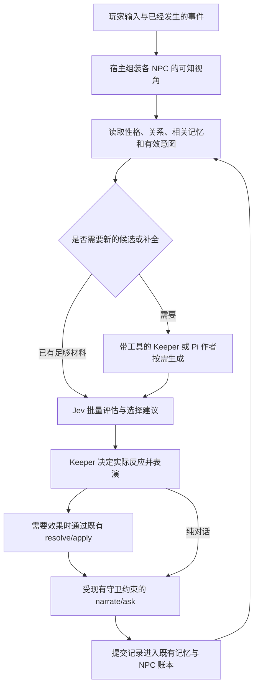

# NPC 性格、关系记忆与当面行为方案

状态：讨论整理稿，供后续设计与实施评审；不是已实现功能或验收报告。

日期：2026-09-21。源码参考：`0.9.4a`，HEAD `fb5c4c324` 及当时工作区中已有的未提交实现。本次仅新增本方案，不修改生产代码、现有契约、Mod、战役或玩测证据。

## 1. 用户意图与已经确定的方向

用户希望：眼前的人有自己的性格和主意，记得与你的关系；同一件事，不同人物会作出不同而可理解的反应。聚光灯仍留给玩家。

本轮讨论确定的产品方向：

1. **性格参与行为选择。** NPC 的区别落实到愿意做什么、提出什么条件、如何拒绝和表达，不仅是口吻或口头禅。
2. **共同经历持续影响关系。** NPC 记得玩家做过的具体事情，并据此调整对这个人的判断。
3. **玩家是中心。** NPC 可以主动、拒绝、谈条件，也可以不介入；不要求每人每轮行动，不为展示系统而抢戏。
4. **缺少性格材料时可以生成。** 优先依据已有描述；在材料空白处，可结合身份、经历和处境生成带随机差异的描述，确立后持续使用。
5. **离场不持续模拟。** 下次相遇时，LLM 根据最后状态、经过时间和已知世界事件，现场补出合乎逻辑的后续经历；不要求这些经历此前真的跑过。
6. **既成内容持续有效。** 重逢时确立的后续保存下来，之后继续发展，不能每次重新编出另一份过去。
7. **Jev 做大量有界判断，Keeper 做生成和表演，内核掌握状态与规则。**

成功的体验是：玩家能感到“他记得我，他的反应有自己的理由，而且他一直是这个人”；同时，接下来往哪里走仍由玩家决定。

空心交付包括：新增很多性格字段却无人使用；每轮大量评分但所有人反应一样；人物卡很丰富但重逢失忆；Jev 调用更快而整回合更慢；用后台模拟量、台词长度或测试数量代替人物体验。

## 2. 本方案范围

包括：稳定性格的来源与补全、面向特定对象的关系记忆、NPC 可知视角、当面反应候选与 Jev 判断、Keeper 表演、重逢时按需生成后续、持久化与验收。

不包括：离场人物的逐时模拟、全图 NPC 定时更新、独立 NPC 聊天窗口、后台社会仿真、全套数值人格系统、新的玩家操作面板、重建作者模组图、恢复旧 Python 内核。

本方案中的流程与数据职责是建议。实施前须在 `docs/kernel-rpc.md` 完成对应契约，尤其是新增材料的写入者、可知视角、关系投影和重逢后续的提交形状。本文件不自行扩大现有 RPC 或 Mod 的权限。

## 3. 调研依据与当前基础

### 3.1 三代本地实现

| 实现 | 已发现的生产与消费路径 | 本方案取舍 |
| --- | --- | --- |
| ChatLab TRPG | 每个 IC 回合后，一次主模型全上下文预演，批量生成下一轮在场人物、心理和可能行动；写 staging，下一轮 preprocess/GM 消费。另区分了解玩家的程度、已知事实、互动兴趣及其动因 | 保留“兴趣不等于知情”“目标完成不等于社交兴趣消失”。本方案按需要生成性格或后续，不保留每轮全上下文预演的默认成本 |
| Chatrpg | 后台生成意图卡；前台 ActionBoard 匹配、过期检查、仲裁，形成给 GM 的行为提示。知识、记忆、关系和状态已有独立表达及持久化 | 保留条件化意图与实际执行分离。用模型判断替代旧关键词分类、字符重叠和手写人格公式，不移植旧 Python |
| 当前 PipiCOC | 作者档案与知识/信念关系，经 NPC 胶囊进入 Keeper；收据更新 NPC 账本，记忆挂接承诺等历史；已有第一印象与 voice；Jev 接入若干证据、记忆、结算任务 | 在这条 TS 路径上扩展人物决策，复用现有身份、来源引用、任务预算、事务和记忆。不另建 NPC 图谱或第二套世界真相 |

这部分是静态源码与调用链调研，不代表本轮运行或验收过旧产品。两个重要区别：ChatLab 是一次批量预演，不是每 NPC 一次调用；Chatrpg 前台默认 planner 仍是规则实现，后台才有真实生成调用。ChatLab 的 `npc_action_search.select_npc_actions` 在所查 TRPG 调用树中只有定义，不能算作已接线收益。

当前实现入口：

- [NPC 作者材料读取](../../kernel-ts/read/module-graph.ts)：`npcProfile`、`npcKnows`、`npcBeliefs`、`npcWouldSay`、`npcTies`。
- [NPC 胶囊与详细查看](../../kernel-ts/read/capsule.ts)：`npcEntry`、`npcView`、`npcHistory`。
- [NPC 账本](../../kernel-ts/write/contributions.ts)：`foldNpcTurn`、`noteMemory`。
- [记忆检索与证据视图](../../kernel-ts/read/memory.ts)、[Jev 记忆写入](../../runtime/jev/memory-write-domain.ts)。
- [NPC 效果](../../kernel-ts/apply/entities.ts)、[桌上档案写入](../../kernel-ts/mods/stage.ts)。
- [Jev 契约](../../runtime/jev/contracts.ts)、[任务宿主](../../runtime/jev/task-host-session.ts)、[规范操作分派](../../extensions/kernel/canonical-operation-dispatcher.ts)。
- [Natural NPC](../../mods/natural-npc/brief.md)、[NPC voice 既有设计与验收边界](npc-voice-natural-speech.md)。

现有 `apply dossier` 只接受启用包贡献的键；普通值是一条有长度上限的文本，`lines` 形状由对应车道负责，并且不能覆盖作者材料。因此“复用档案”不等于现有接口已经能存任意人格对象，不能直接塞入新字段绕过所有权。

### 3.2 外部先例

| 一手来源 | 支持什么 | 与本方案不同的约束 |
| --- | --- | --- |
| [TypeSafe Primitives](https://docs.typesafe.ai/primitives)、[fan-out](https://docs.typesafe.ai/patterns/fan-out) | 同一输入下独立小判断可以并行，代码组合结果 | 同批 Choice 不会读取同批 Score；存在真实依赖才进入下一批 |
| [Guild Wars 2 Utility AI](https://www.gameaipro.com/GameAIPro3/GameAIPro3_Chapter13_Choosing_Effective_Utility-Based_Considerations.pdf) | 候选动作分因素评价；先排除不能执行的动作；防止无效重复和频繁切换 | 不能把战斗 AI 的手写语义规则和评分曲线直接当成人物心理学 |
| [Versu](https://cs.uky.edu/~sgware/reading/papers/evans2014versu.pdf) | 情境提供行动机会，人物按自己的欲望选择；关系评价可以多维、非对称且保留原因 | 候选贫乏时性格差异也无法体现；其全知世界模型不适合直接用于悬疑 TRPG |
| [CiF / Prom Week](https://ojs.aaai.org/index.php/AIIDE/article/download/12454/12313/15982) | 发起意愿、回应意愿、前提、效果与表现分开 | 借职责划分，不照搬大量手写社会规则 |
| [Generative Agents](https://arxiv.org/html/2304.03442v2) | 记忆检索、反思和计划帮助维持行为连续性 | 本方案主动舍弃持续离场模拟，只在互动需要时补全 |

这些先例支持职责划分，不证明本项目采用后必然提高速度或人物质量。TypeSafe 的[模型说明](https://docs.typesafe.ai/models)与[已知限制](https://docs.typesafe.ai/model-jaggedness/jev-1.13)也要求分别验证中文、长上下文和复杂因果任务。

## 4. 人物由哪些材料构成

| 层次 | 内容 | 更新方式 |
| --- | --- | --- |
| 稳定性格与价值取向 | 习惯怎样看待风险、原则、人情和冲突；珍视什么；内在矛盾 | 初次确立后保持，重大经历可产生有依据的演变 |
| 个人处境与目标 | 当前想得到、保住或避免的事情 | 场景发展、实际事件或重逢后续确立时更新 |
| 面向特定对象的关系 | 他怎样看这个调查员或其他人物，以及为什么 | 由共同经历与明确关系变化持续积累 |
| 知识与信念 | 亲历、听闻、相信、误信、尚未知晓及来源 | 新见闻与已确立交流；保留说法和事实的区别 |
| 当下情绪与压力 | 疲惫、受惊、受辱等当前反应 | 按情境解释；有持续意义时才保存变化 |
| 历史牵挂 | 承诺、未解决冲突、交易、最后相遇状态 | 引用已有记忆与收据，不复制另一套账 |

这些是组织材料的视角，不是每人必须填满的维度，也不是固定的性格标签集合。多名调查员时，不能只用统一的 `toward_party` 表达全部私人关系；现有队伍态度继续有效，人物间差别由指向具体对象、带来源的关系材料表达。

### 4.1 性格来源与生成

作者明确写出的描述优先。模型可以提炼其行为含义，但不能把推断冒充原文。已经在桌上确立的身份、经历和行为也要作为约束。

材料不足时，带工具的 Keeper 或 Pi 作者任务可生成一次相容、具有差异的性格描述。随机性体现在模型提出的具体组合与表达，不通过代码里的职业、性别、名字、语言或标签映射决定性格，也不把所有人抽成几类固定模板。

建议使用少量具体语句，表达价值取向、习惯和内在张力，例如：

> 他爱惜自己的名声，公开场合谨慎守规矩；但很难拒绝真正帮过自己的人，常愿意私下承担一点风险。他不喜欢直接拒绝，通常先解释自己的难处。

这是设计例子，不是生产提示或必须复制的卡面。实际系统指令与宿主材料遵循项目英文契约，玩家可见文字由 Keeper 按 `play_language` 生成。

生成材料标明来自桌上补全，保留原始草稿和接受版本；没有作者引用时不伪造引用。身份、技能、物品、秘密或线索归属的新增不随性格生成自动成立。原书尚未完成相关读取时，应把当前资料标为不完整，而不是把所有缺失都判成作者没有写。

确立后按同一 NPC 身份使用，重载、重逢、服务重试都不重新抽取。后来发现新的作者材料与补全冲突时，显式处理该冲突，保留历史，不静默改写已玩过的内容。

### 4.2 性格、关系与口吻的分工

性格影响“怎样权衡”，关系影响“怎样看待这个对象”，处境影响“现在承担得起什么”，voice 影响“怎样说出来”。四者一起解释反应。

例如感激玩家不必然意味着愿意公开作证；人物可能因为家人而拒绝公开，却主动提出私下交出证据。直率的人也会有顾虑，谨慎的人也能作出牺牲。性格是稳定倾向，不是禁止例外的判定器。

现有第一印象、社会检定和态度收据继续按各自规则工作。性格评价不能凭高分重掷结果、改变难度或自动解锁秘密；需要机制效果时仍经现有规则与事务。

## 5. 当面互动流程

这是职责图，不要求每次普通对话经过所有步骤。当前上下文足够时，Keeper 可以直接回答；Jev 不成为每句话前新增的固定审查关卡。

### 5.1 可知视角

先由宿主按身份、来源、场景和作用域组织输入，再做语义判断。作者知道、Keeper 知道、玩家知道、NPC 知道是不同的集合。

当前 `recall about=<name>` 匹配 `subject/knowers/entities`，找的是“与这个人有关”，不能直接拿来当“这个人知道”。关系检索可以用这个集合；NPC 决策输入需要进一步按已确立的获知来源投影。无法确认的知情关系保持未知；可用 Jev 提供语义建议，但分类结果本身不能授予知识。

默认按相同可知范围分组批处理，可并发处理多个组。同一公共 state 不放其他 NPC 的私有秘密。把私有材料放进单题 supporting data 的优化只作为后续候选，必须先验证服务与适配器的实际隔离行为。

### 5.2 候选意图

候选来自作者给出的动机与机会、已有计划和承诺、当前上下文中 Keeper 提出的可能性。缺少合适候选时，允许带工具的生成 owner 补充；不在每轮前固定增加一次大模型 planner。

每个候选应表达：想达成什么、面向谁、依赖哪些可知事实、何种条件下可行、涉及哪些可能效果。它不是预写台词，也不是世界里已经发生的动作。

候选集保留继续当前计划、暂不介入、缺少合适候选的出口。对玩家的直接问题，直接回答也必须是正常可能性；不能只给回避、试探、制造冲突等候选。

候选受输入、世界、人物材料和记忆版本约束；再次使用前检查前提。单纯“还在三回合 TTL 内”不能证明仍适用。没有相关变化时可复用有效材料，不反复生成同一个人。

### 5.3 Jev 判断与选择

| 对象 | 可并行的小判断 | 结果的消费者 |
| --- | --- | --- |
| 已授权的记忆候选 | 与当前对话的相关性；是否改变该人物的理解；是否存在反证 | NPC 上下文投影 |
| 当轮事件 | 对现有目标、关系或压力是否重要；是否值得记录或重新考虑 | Keeper 反应建议、既有记忆写入建议 |
| 各个意图 | 是否符合具体性格依据；是否有助于目标；风险是否可接受；是否违背承诺；是否与已知事实矛盾 | 候选选择与 Keeper |
| 有限候选集 | 当前最合适的反应；继续原计划；不介入；候选不足 | Keeper 的决定支持 |
| 已有计划 | 前提是否失效；目标是否已完成；是否需要新候选 | 宿主缓存失效与按需生成 |

问题要明确点名目标材料或宿主签发的候选别名；question key 只是相关性标识，不承担语义。沿用 shared SourceRef，由宿主提取已存在的原文；模型不抄 UUID、哈希、偏移或收据。

评分与选择有两种合法组合：已有候选上可独立直接问 Choice，Score 用于诊断或明确策略；若选择确实依赖先前评分，宿主按明确规则组合，或将结果作为下一批输入。不得假设本批 Choice 看过本批 Score，也不默认把所有因素加成一个“人格总分”。

硬约束先由现有内核与宿主检查，例如当前是否能行动、资源是否可用、来源是否越权。Jev 负责开放语义，不能用关键词、正则或职业映射替代。数学、时间计算和骰子仍由代码负责。

分数是本次判断的遥测，不是永久人格值、规则数值或知识真值。模型低置信度意味着需要 Keeper 判断或补证据，不自动表现为 NPC 犹豫；Choice 概率也不直接解释为人物随机行动的概率。

### 5.4 表演、执行和反馈

给 Keeper 的结果应短而可用：关键记忆、关系依据、建议意图、允许使用的事实、顾虑、未知项。不是完整评分矩阵，也不是必须演出的动作清单。

Keeper 可以接受建议，也可根据当前交流选择其他有依据的反应。多 NPC 的意图只是各自建议；共享资源、相互回应和行为顺序要在实际执行前协调。一个实际结果改变后续判断时，重新取当前状态，不能预先并行提交依赖未知结果的动作。

NPC 不负责替玩家作出选择。未被采用的意图只作诊断，不进入下一轮成为“欠一次表现”的义务。普通交流、拒绝和自然结束都可以成立，不要求每轮有新事件或进展。

世界变化继续经 `resolve/apply`；文本经现有 `narrate/ask`。回合提交后，既有记忆车道提取带归属的交流证据，账本读取实际收据。一次生成、一次评分或一句 NPC 自述均不直接证明对应世界事实。

## 6. 重逢时补全离场后续

离场只需保留最后状态、关系、未完承诺与已有目标；不为这个 NPC 启动持续模拟，也不按现实墙钟时间推进游戏世界。

重逢且需要解释现状时，Keeper 或带工具 Pi 作者读取：最后一次相遇及其游戏时间、当前游戏时间、稳定性格、关系事件、未完事项、已确立世界事件，以及本次相遇情境。LLM 生成足以支撑这次互动的后续。

生成可以包括：日常生活的变化、既有目标的进展、对过去互动的看法、解释当前处境的经历。无显著变化同样有效，不要求每次重逢都有新故事。

后续必须与既成材料、能力和时间相容，不替玩家补做行为，不追溯取消已经生效的收据，不越过作者固定事实。涉及玩家正在选择的关键问题、重要资源或秘密时，按既有世界变化和来源权限处理，不借离场补全完成另一条未经选择的剧情。

### 6.1 后续的成立与保存

- 生成草稿是提案，尚未成立。
- Keeper 采用并通过对应持久化路径接受的后续，作为桌上确立的后续保存，标明生成来源；它不需要伪造期间逐回合事件或骰子记录。
- NPC 讲述的版本记录为该人物的说法，可以不完整或不真实；不自动升级为世界事实。
- 对当前位置、物品、资源、条件等产生影响的部分，必须有对应合法效果；叙述不能替代它。
- 保存后，同一离场区间的再次读取、重试和重逢复用已接受版本；新内容只能补充未定部分，不能重抽旧事实。
- 未采用或失效草稿可以保留为诊断，不污染人物历史；重启与并发完成也不能造成两份相互矛盾的接受版本。

已有接口是否能完整表达“仅确立一段离场经历”需要在契约阶段逐项确认；若现有 memory/ruling/人物记录不足，应扩展其正式 owner，而非直接写存档或另建时间线。无需为了存一段后续而模拟它的每个过程。

## 7. 写入、读取、行动的完整链

以下是目标职责，不宣称所有新增形状已经存在。

| 材料 | 谁写 | 谁读 | 谁据此行动或接受 |
| --- | --- | --- | --- |
| 作者性格依据 | 现有来源读者与图谱发布 owner | NPC 档案、视角与 Keeper | Keeper；Jev 只作解释或选择 |
| 补全的稳定性格 | 带工具作者提案；现有 NPC/档案 owner 经明确契约接受 | 胶囊、详细查看、后续 NPC 判断 | Keeper 扮演；身份绑定的接受版本持续复用 |
| 关系事件与承诺 | 现有收据、提交的交流记录及 memory owner | 指向对象的关系投影、recall、NPC 视角 | Keeper 调整反应；实际关系效果经正式写入 |
| 临时情绪与意图 | Keeper/作者提案，Jev 评价 | 当前回合的 Keeper | 采用时表演或走正式操作；不默认长期保存 |
| NPC 可知视角 | 宿主从已有权威与有归属证据派生 | NPC 判断任务 | 不写回世界、不授予新知识 |
| 重逢后续 | 带工具作者提案，正式记录/效果 owner 接受 | 之后的记忆、人物投影、重逢生成 | Keeper 按接受版本继续；相关效果由内核负责 |

人格、关系材料属于已有 NPC 层的扩展。实现应把材料组装、失效判断和批量评估集中在小的内部 interface 后面，复用 TaskRuntime 与 canonical dispatcher；不新增一组 Keeper 必须手工串联的公共动词。

详细契约需明确：源材料/生成补全/桌上事件的不同权威；稳定人格与运行时演变分开；关系的对象与方向；身份/世界线/loop/版本绑定；单次接受与重放；缺失值和不可用结果；核心或 Mod 所有权与禁用行为。新增字段只有在真实读者和采用路径存在时才算完成。

## 8. 性能、失败与兼容

普通对话保持直接路径。首次性格补全、已有候选评估和重逢后续分别按需求运行；不全图生成，不每轮重新生成，不用“后台”掩盖持续调用成本。

独立判断合批，依赖判断顺序执行。复用现有 Jev 的预算、取消、版本验证、来源提取和错误表示。新增缓存若必要，必须按实际依赖绑定，不能把旧状态上的高分建议复用到已变化的情境。

可选 NPC 决策辅助不可用时，Keeper 用已知材料正常扮演，并保留不可用记录；不能捏造成功评分或把缺失答案当作允许。必需的来源、准入、结算与提交检查仍按其现有失败策略处理。拒绝或未完成的人格/后续提案不会成为已接受事实。

现有战役按需补材料，不批量改写；已接受的性格和经历在辅助功能关闭后仍是已成立材料，不能消失。若选用 Mod 承载，必须显式解决这一要求与当前“关包隐藏包档案”的语义差异，不能直接假定兼容。Jev 关闭时的读取和 Keeper 扮演仍应可用。

当前[预筛探索性 A/B 记录](../research/jev-prescreen-repair-ab-20260921.md)报告：五个配对窗口中，ON 的 Keeper 轮次由 30 减至 23，而整回合总用时由 501.186 秒变为 517.910 秒。存在骰子、修复、服务和并发等干扰，不能归因或外推；它提示本方案必须测整回合体验，不能只数减少了多少大模型调用。

## 9. 建议实施切片

这些是未来实施顺序，本次写方案没有执行任何切片。

| 切片 | 交付范围 | 完成证据 |
| --- | --- | --- |
| A：冻结职责与材料契约 | 在 §17、相关记忆/档案契约与 §122 记录新增形状和 owner；确定核心/Mod 所有权；把现有 NPC 材料接成可知视角与面向对象的关系投影 | 每项都有写入者、读者、采用者；旧材料可读，来源与知识范围不混淆 |
| B：稳定性格补全 | 从作者描述提炼、空白处按需生成、接受后固定，支持 reload 与后来材料冲突处理 | 不同人物有具体差异；重启不重抽；作者材料不被覆盖；Keeper 确实读到 |
| C：当面反应与关系记忆 | 候选供给、Jev 合批评估/选择建议、当前状态校验、Keeper 表演，复用真实交流和收据更新记忆 | 历史和性格改变真实反应；普通对话可直接进行；有主见且不夺取玩家选择 |
| D：重逢后续 | 按最后状态和游戏时间即时生成、接受、再次复用；不启动离场模拟 | 跨场景/重启后人物连续；同一间隔不重复改写；后续能被之后的互动使用 |
| E：真桌体验与性能比较 | 在冻结的源/build、模型、启用状态与资料条件下对照 | 质量、连续性、玩家控制权及整回合成本都有证据；保留不利样本 |

优先让 A–C 在当面互动里产生真实差异，再完成 D。不要先做一个丰富但无人消费的人格数据库，也不要先做大量离场后续内容。

## 10. 验收标准

### 10.1 可重复的接口与决策验证

- 作者明确材料与生成补全可区分；重试、重载、重复相遇不重抽人格，不重复接受后续。
- 同一经历对不同对象的关系影响不被抹成队伍总好感；重叠、独立、矛盾记忆保留各自归属。
- 与 NPC 有关但他并不知道的秘密，不进入其决策视角；玩家猜测不变成 NPC 已知事实。
- Jev 缺答案、不可用、候选不足、版本变化时走声明路径；不静默执行旧建议。
- 角色不能行动、物品已转移、承诺已兑现等既成条件在采用前得到尊重。
- 关闭辅助后仍能读已经成立的性格、经历和关系；旧战役不依赖全量迁移才能继续。

语义诊断可使用相同情境的成对材料：改变性格、改变关系事件、改变知情范围，观察候选评估和解释是否随之合理变化。不得规定“内向必须拒绝”一类唯一标签答案；评分稳定、结果多样也不能单独证明人物可信。

### 10.2 真桌体验

遵循 [acceptance](../acceptance.md) 与项目真桌契约：`tests/play/driver.py` 通过 RPC 启动 `bin/pi-coc`，Grok 当 Keeper，主会话当唯一玩家，一次自然输入一回合。续局先走规定的 resume；保留所有原始记录。离线候选测试、fixture 或脚本化玩家不替代玩测。

在自然推进中观察：

1. 不同性格的人面对相近请求，能表现出不同且有依据的取舍，而不只换措辞。
2. 玩家帮过、欺骗过或守约后，后续反应能找到具体历史依据；亲近也不等于无条件配合。
3. NPC 可以回答、主动提条件、拒绝、结束对话或不介入；不会人人抢话、强留玩家或每轮制造任务。
4. 分开一段游戏时间后重逢，有需要时给出合理后续，之后再次提起仍然一致；无需离场模拟记录。
5. 反应不泄露人物不知情的秘密，不把玩家推测或 NPC 自述当成已证实世界事实。
6. 性格不被表演成每句话重复的口头禅，也不强迫所有回应展示“人物特色”。

### 10.3 测量与验收边界

记录端到端回合耗时、首次有效正文时间、Jev 耗时、生成调用次数、输入量、超时/回退、候选实际采用及弃用原因。样本不足时列出逐回合结果，不把少数样本包装成可靠的 p95。

同时保留行为质量判断：历史是否真正改变选择，性格是否持续，拒绝和条件是否合理，玩家是否保有控制，是否出现知识泄漏。接受更多候选、产生更多收据或运行更多回合都不自动代表更好。

速度收益、人物体验收益、来源与事务正确性分别报告；没有实际改善的切片不能靠测试数量宣称完成。

## 11. 实施前需要收敛的技术选择

产品方向已经明确，不重复询问是否要离场模拟或谁掌握聚光灯。以下是实施设计要依据当前契约解决的问题：

- 稳定性格与被接受的后续由现有 NPC 层的哪个正式 owner 保存；推荐扩展已有路径，避免第二份状态真相。
- 按需生成怎样复用 Keeper/已有带工具任务，并避免每轮强制新增 planner 往返。
- 多人关系与可知视角如何投影到当前胶囊预算；推荐先提供关键原因与少量相关事件，详细材料继续可查。
- 新辅助默认启用范围、失败预算与回滚条件；推荐先做有明确边界的验证，再决定推广，不从组件测速直接设全局开关。

这些技术选择应在首个契约切片内形成明确决定。只有实质改变上述产品范围时再与用户讨论，不把日常实现细节变成反复确认。

## 12. 历史源码定位

以下为本机只读研究入口，历史实现不属于当前生产维护范围：

- ChatLab：`/Users/haoli/leehow/code/chatlab/backend/agents/trpg/npc_presim.py`、`phase_postprocess.py`、`phase_preprocess.py`、`scene_runtime.py`、`npc_action_search.py`。
- Chatrpg：`/Users/haoli/leehow/code/chatrpg/backend/services/trpg_npc/orchestrator.py`、`npc_planner.py`、`action_board.py`、`action_resolver.py`、`knowledge_profile.py`、`background_planner_prompt.py`、`optimization/event_classifier.py`。
- 当前权威：[kernel RPC](../kernel-rpc.md) §17、§28、§40、§122；[Jev 统一设计](jev-unified-runtime-refactor.md)；[Jev 验收交接](../handoff-jev-acceptance-20260920.md)。旧规格中的 Python 路径仅代表历史，实际维护入口以当前 TS 源码为准。
