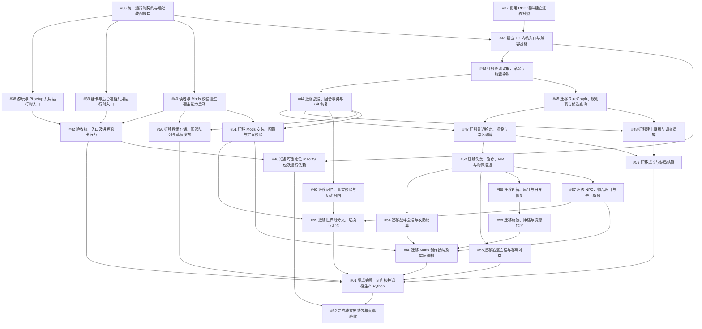

# Runtime consolidation ticket plan

## 实现进度

- 用户已授权实现整个 #35，并要求删除旧 Pi 的两份未合入产物后重做。
- `rt-compose`、`rpc-corpus` 工作树及对应分支已按本轮授权删除；未发现战役证据。
- 集成工作位于 `codex/runtime-consolidation`，以干净的 `0.9.2a` 为起点；原有规格和票继续沿用。
- #36 已重新实现：每个 owner 捕获部署配置，独立持有内核；关闭/取消阻止迟到请求与重启，退出有超时错误。真实 Python hello 成功，扩展套件 160 项通过。
- #37 已重新实现运行时选择及严格 RPC/状态比较。59 个既有语料在两个独立 Python 进程间校准一致；不丢弃时间戳、骰子、收据、哈希或状态。此结果尚不证明 TS 兼容性。
- 对照证据保存在主检出的 `.coc/playtests/runtime-consolidation/checks/`；运行时实现位于自有集成工作树，仍需完成后续票与最终验收。
- 内核/驾驭器全套首次为 1225 通过、1 跳过、1 失败；失败是旧测试假定 uv 包装进程。已改为终止实际 RPC 内核，相关 37 项检查通过；全套复跑待完成。
- 完成标准仍是 #62 的独立安装包和真桌验收，不能以某个中间切片代替。

状态：**已发布并核对**。用户已批准本拆分；27 张直属子票、45 条原生阻塞关系和所有正文已核对。当前任务未派发 worker 或修改实现。

- 父规格：[#35](https://github.com/Leehow/chatrpgv4/issues/35)，用于汇总；执行范围为直属子票。
- 本地规格：[runtime-consolidation.md](runtime-consolidation.md)
- 基线：**0.9.2a**（plan.json 记录 base `929bb4f1de3fffd3e2e78baa731ad17c72129033`；派发时重新核对当前集成头）
- 27 份独立工单已按拓扑顺序发布；下列链接、前置票和图均使用实际 GitHub 编号。
- 发布核对时间：2026-09-09T01:07:25.779Z；已核对父子关系、阻塞关系、标签及远端正文与本地工单的一致性。

## 27 个工单

### A 阶段：运行时归属合并（Python 仍在生产路径）

1. **[#36 统一运行时契约与启动装配接口](https://github.com/Leehow/chatrpgv4/issues/36)** — 前置：无 — 交付：一个 host-owned 组合统一提供 executable/content/home/cancellation，定义注册 seam 与 lane 归属规则，仅迁移最小 hello/start/close。
2. **[#38 游玩与 Pi setup 共用运行时入口](https://github.com/Leehow/chatrpgv4/issues/38)** — 前置：[#36](https://github.com/Leehow/chatrpgv4/issues/36) — 交付：七个 Keeper verb 的 play 会话与 setup 会话改走共享组合，保持 RPC 顺序、shutdown gate、bounded reopen 与显式战役绑定。
3. **[#39 建卡与后台准备共用运行时入口](https://github.com/Leehow/chatrpgv4/issues/39)** — 前置：[#36](https://github.com/Leehow/chatrpgv4/issues/36) — 交付：pre-Keeper catalog、source preparation、guided creation、presentation worker 使用 host-owned 启动与 home，保持阶段进度、重启与取消。
4. **[#40 读者与 Mods 校验通过宿主能力启动](https://github.com/Leehow/chatrpgv4/issues/40)** — 前置：[#36](https://github.com/Leehow/chatrpgv4/issues/36) — 交付：reader runner 与只读 check 从 host 取得 source/draft/Mod-check 能力，保留工具型 Pi 与共享 validator。
5. **[#42 验收统一入口及进程退出行为](https://github.com/Leehow/chatrpgv4/issues/42)** — 前置：[#38](https://github.com/Leehow/chatrpgv4/issues/38)、[#39](https://github.com/Leehow/chatrpgv4/issues/39)、[#40](https://github.com/Leehow/chatrpgv4/issues/40) — 交付：集成 A lane，验证换运行时/换资源只改组合、取消重启释放 writer/lease；仍是中间结果。

### 对照与内核基础

6. **[#37 复用 RPC 语料建立迁移对照](https://github.com/Leehow/chatrpgv4/issues/37)** — 前置：无 — 交付：现有确定性 RPC 场景可显式选择 runtime，在隔离工作区对照 reference/candidate，Python 保留为 oracle。
7. **[#41 建立 TS 内核入口与兼容基础](https://github.com/Leehow/chatrpgv4/issues/41)** — 前置：[#36](https://github.com/Leehow/chatrpgv4/issues/36)、[#37](https://github.com/Leehow/chatrpgv4/issues/37) — 交付：可选 development-only TS JSONL 入口，真实 hello/list、串行 error/close、兼容 canonical JSON 与 seed sampling、原子写与锁原语，冻结注册、settlement 与只读快照接口，并指定共享函数的唯一归属。

### B 阶段：逐族迁移（生产默认仍是 Python）

8. **[#43 迁移图谱读取、桌况与胶囊投影](https://github.com/Leehow/chatrpgv4/issues/43)** — 前置：[#41](https://github.com/Leehow/chatrpgv4/issues/41) — 交付：graph lookup、桌况与 capsule 投影在 TS 可达，保持 secrecy、来源身份、九段预算与 Director 评分。
9. **[#44 迁移战役、回合事务与 Git 恢复](https://github.com/Leehow/chatrpgv4/issues/44)** — 前置：[#43](https://github.com/Leehow/chatrpgv4/issues/43) — 交付：campaign create/open 与 player-input/ask/narrate 闭回合，保持 save schema、幂等、同步 Git commit 与恢复。
10. **[#45 迁移 RuleGraph、规则表与候选查询](https://github.com/Leehow/chatrpgv4/issues/45)** — 前置：[#43](https://github.com/Leehow/chatrpgv4/issues/43) — 交付：规则/目录查询与 decision/slot planning 在 TS 可达，保持 digest、catalog、skills 与 needs/needs_choice 闭合响应。
11. **[#47 迁移普通检定、推骰与幸运结算](https://github.com/Leehow/chatrpgv4/issues/47)** — 前置：[#44](https://github.com/Leehow/chatrpgv4/issues/44)、[#45](https://github.com/Leehow/chatrpgv4/issues/45) — 交付：普通/对抗/社交/心理检定、奖惩骰、push/luck 与通用资源效果的 action-to-receipt TS resolve。
12. **[#48 迁移建卡草稿与调查员库](https://github.com/Leehow/chatrpgv4/issues/48)** — 前置：[#44](https://github.com/Leehow/chatrpgv4/issues/44)、[#45](https://github.com/Leehow/chatrpgv4/issues/45) — 交付：occupation、rolled/quick-fire、review/confirm 与调查员库复用，保持 sheet digest、分配、年龄与幂等。
13. **[#52 迁移伤势、治疗、MP 与时间推进](https://github.com/Leehow/chatrpgv4/issues/52)** — 前置：[#47](https://github.com/Leehow/chatrpgv4/issues/47) — 交付：伤势、治疗/恢复、MP 再生与时钟换算，保留近期 time-unit 与日界修复并防止重复应用。
14. **[#54 迁移战斗会话与攻防结算](https://github.com/Leehow/chatrpgv4/issues/54)** — 前置：[#52](https://github.com/Leehow/chatrpgv4/issues/52) — 交付：战斗 start/attack/defense/damage/round/end，使用真实武器目录与 actor/NPC profile，保持弹药、伤势与 pending choice。
15. **[#55 迁移追逐会话与移动冲突](https://github.com/Leehow/chatrpgv4/issues/55)** — 前置：[#52](https://github.com/Leehow/chatrpgv4/issues/52) — 交付：追逐 setup/movement/hazard/participant/choice/结论，保持 MOV/action 预算、伤势与 receipt replay。
16. **[#56 迁移理智、疯狂与日界恢复](https://github.com/Leehow/chatrpgv4/issues/56)** — 前置：[#52](https://github.com/Leehow/chatrpgv4/issues/52) — 交付：SAN check/loss、bout、reality check、insight/treatment/recovery 与日界行为，保留 canonical 日界修复。
17. **[#58 迁移施法、神话与资源代价](https://github.com/Leehow/chatrpgv4/issues/58)** — 前置：[#56](https://github.com/Leehow/chatrpgv4/issues/56) — 交付：法术发现/学习/施放与 Mythos 效果，保持 source-bound 事实、known/candidate 区分与快照 digest。
18. **[#53 迁移成长与结局结算](https://github.com/Leehow/chatrpgv4/issues/53)** — 前置：[#47](https://github.com/Leehow/chatrpgv4/issues/47)、[#48](https://github.com/Leehow/chatrpgv4/issues/48) — 交付：技能成长、恢复/奖励结算、结局核算与调查员写回，保持一次性结算 guard 与章节续接/完结区分。
19. **[#57 迁移 NPC、物品账目与手卡效果](https://github.com/Leehow/chatrpgv4/issues/57)** — 前置：[#52](https://github.com/Leehow/chatrpgv4/issues/52) — 交付：move/clue/item/cash/NPC/flag/note/ruling/handout 效果与视图，保持 actor ownership 与事务回滚。
20. **[#49 迁移记忆、事实校验与历史召回](https://github.com/Leehow/chatrpgv4/issues/49)** — 前置：[#44](https://github.com/Leehow/chatrpgv4/issues/44) — 交付：memory job/submit/fail、facts/warnings、transcript/current-line recall 与续接证据，保持 advisory 非阻塞与 supersession。
21. **[#59 迁移世界线分叉、切换与汇流](https://github.com/Leehow/chatrpgv4/issues/59)** — 前置：[#57](https://github.com/Leehow/chatrpgv4/issues/57)、[#49](https://github.com/Leehow/chatrpgv4/issues/49)、[#51](https://github.com/Leehow/chatrpgv4/issues/51) — 交付：fork/switch/loop/merge，保持 per-line seed、Git parent、anchor、clock/snapshot 与冲突处置；真实世界线覆盖缺口留给最终验收。
22. **[#50 迁移模组存储、阅读队列与草稿发布](https://github.com/Leehow/chatrpgv4/issues/50)** — 前置：[#44](https://github.com/Leehow/chatrpgv4/issues/44)、[#40](https://github.com/Leehow/chatrpgv4/issues/40) — 交付：module bind/status/read claim/submit、readiness 与草稿校验在 TS，host 仍负责 PDF.js 页面访问。
23. **[#51 迁移 Mods 安装、配置与定义校验](https://github.com/Leehow/chatrpgv4/issues/51)** — 前置：[#44](https://github.com/Leehow/chatrpgv4/issues/44)、[#40](https://github.com/Leehow/chatrpgv4/issues/40) — 交付：pre-Keeper 与 bound-session Mod 管理、不可变 folder/ZIP、命名空间迁移与只读定义校验。
24. **[#60 迁移 Mods 创作接纳及实际机制](https://github.com/Leehow/chatrpgv4/issues/60)** — 前置：[#54](https://github.com/Leehow/chatrpgv4/issues/54)、[#58](https://github.com/Leehow/chatrpgv4/issues/58)、[#57](https://github.com/Leehow/chatrpgv4/issues/57)、[#51](https://github.com/Leehow/chatrpgv4/issues/51) — 交付：Mod job/accept 与 Natural NPC / Enhanced Items 的 apply/resolve，生成物在关闭/升级生成器后仍可用；覆盖当前文档载体的查看、编辑、取得时快照、归属与版本冲突。

### 集成、打包与最终验收

25. **[#61 集成完整 TS 内核并退役生产 Python](https://github.com/Leehow/chatrpgv4/issues/61)** — 前置：[#42](https://github.com/Leehow/chatrpgv4/issues/42)、[#55](https://github.com/Leehow/chatrpgv4/issues/55)、[#53](https://github.com/Leehow/chatrpgv4/issues/53)、[#59](https://github.com/Leehow/chatrpgv4/issues/59)、[#50](https://github.com/Leehow/chatrpgv4/issues/50)、[#60](https://github.com/Leehow/chatrpgv4/issues/60) — 交付：全 RPC 盘点、全量差分与必需套件、入口切换 TS、移除生产 Python/uv；不得用子集或 mock 套件收口。
26. **[#46 准备可重定位 macOS 包及运行依赖](https://github.com/Leehow/chatrpgv4/issues/46)** — 前置：[#42](https://github.com/Leehow/chatrpgv4/issues/42)、[#41](https://github.com/Leehow/chatrpgv4/issues/41) — 交付：macOS arm64 打包配方与运行闭包，证明重定位候选能启动已实现 TS 入口；早期打包证明不是完整游戏验收。
27. **[#62 完成独立安装包与真桌验收](https://github.com/Leehow/chatrpgv4/issues/62)** — 前置：[#61](https://github.com/Leehow/chatrpgv4/issues/61)、[#46](https://github.com/Leehow/chatrpgv4/issues/46) — 交付：最终 App 在干净 macOS arm64 上完成 setup/UI/play/save/Mod/worldline 真桌验收；真实 blocker 保持 gate 打开。

## 逻辑依赖 DAG

上图只表达逻辑依赖，不表示已存在调度器或已开始执行。

## Worker 模型策略

| 工单 | 角色/模型 |
| --- | --- |
| [#36](https://github.com/Leehow/chatrpgv4/issues/36) | lead / Opus |
| [#38](https://github.com/Leehow/chatrpgv4/issues/38)、[#39](https://github.com/Leehow/chatrpgv4/issues/39)、[#40](https://github.com/Leehow/chatrpgv4/issues/40) | Opus |
| [#42](https://github.com/Leehow/chatrpgv4/issues/42)、[#61](https://github.com/Leehow/chatrpgv4/issues/61)、[#62](https://github.com/Leehow/chatrpgv4/issues/62) | lead |
| [#37](https://github.com/Leehow/chatrpgv4/issues/37)、[#46](https://github.com/Leehow/chatrpgv4/issues/46) | Sonnet / Haiku |
| [#41](https://github.com/Leehow/chatrpgv4/issues/41)、[#43](https://github.com/Leehow/chatrpgv4/issues/43)、[#44](https://github.com/Leehow/chatrpgv4/issues/44)、[#45](https://github.com/Leehow/chatrpgv4/issues/45)、[#47](https://github.com/Leehow/chatrpgv4/issues/47)、[#48](https://github.com/Leehow/chatrpgv4/issues/48)、[#52](https://github.com/Leehow/chatrpgv4/issues/52)、[#54](https://github.com/Leehow/chatrpgv4/issues/54)、[#55](https://github.com/Leehow/chatrpgv4/issues/55)、[#56](https://github.com/Leehow/chatrpgv4/issues/56)、[#58](https://github.com/Leehow/chatrpgv4/issues/58)、[#53](https://github.com/Leehow/chatrpgv4/issues/53)、[#57](https://github.com/Leehow/chatrpgv4/issues/57)、[#49](https://github.com/Leehow/chatrpgv4/issues/49)、[#59](https://github.com/Leehow/chatrpgv4/issues/59)、[#50](https://github.com/Leehow/chatrpgv4/issues/50)、[#51](https://github.com/Leehow/chatrpgv4/issues/51)、[#60](https://github.com/Leehow/chatrpgv4/issues/60) | Fable |

- 每个工单一个 owner；worker 只认领无 blocker 且未被认领的直属子工单。
- `commit_policy: no_commit`；base 为 0.9.2a，派发时重新核对当前集成头。
- lead 拥有共享契约编辑、中央 dispatch/registrations/aggregator 接线、集成与 commit。
- 新工作不得编辑别的 lane 的模块；需要共享接口调整时找 lead，并停止依赖该编辑的工作。
- [#36](https://github.com/Leehow/chatrpgv4/issues/36) 与 [#41](https://github.com/Leehow/chatrpgv4/issues/41) 负责基础接口，可在各自串行负责的范围内实现必要共享形状。
- 不新增基础设施，不引入通用 plugin registry。
- 精确路径归属由 lead 在 foundation 确定 placement 后分配；工单文字保持稳定。
- 工单只有在 lead 集成并验证后才关闭，worker 说 done 不算。

## 归属与串行集成规则

- 每个 family 代码在本 family 模块内；共享 core/registration 修改交给 lead。
- 采用 expand–migrate–contract：A 保留 Python 实现并迁移调用方；B 提供可选的开发 TS 内核并逐族移植；最终 cutover 前生产仍走 Python。
- 部分 B 期间，未完成方法必须显式失败，不得模拟成功，也不得从 TS 路径回退调用 Python。
- B 阶段按大范围迁移的 expand–migrate–contract 方式集成：各票证明所列行为，最终跨模块完整性由 [#61](https://github.com/Leehow/chatrpgv4/issues/61) 验证。优先复用现有 RPC；foundation 原语用必要的窄测试接口。胶囊涉及的只读快照函数先明确归属，后续模块复用；未具备的必要事务钩子在写状态前拒绝。
- 不做新的 Keeper、不假 playtest；[#61](https://github.com/Leehow/chatrpgv4/issues/61) 与 [#62](https://github.com/Leehow/chatrpgv4/issues/62) 通过前不宣称 TS 产品完整可玩。
- 集成由 lead 串行完成（[#42](https://github.com/Leehow/chatrpgv4/issues/42)、[#61](https://github.com/Leehow/chatrpgv4/issues/61)、[#62](https://github.com/Leehow/chatrpgv4/issues/62)）；[#46](https://github.com/Leehow/chatrpgv4/issues/46) 的前置完成后可与 B 并行准备，最终游戏验收仍由 [#62](https://github.com/Leehow/chatrpgv4/issues/62) 完成。

## 初始可领取任务

- [#36](https://github.com/Leehow/chatrpgv4/issues/36) 统一运行时契约与启动装配接口。
- [#37](https://github.com/Leehow/chatrpgv4/issues/37) 复用 RPC 语料建立迁移对照。
- 发布核对时这两票无阻塞、未认领；后续以 GitHub 的实时状态为准。[#41](https://github.com/Leehow/chatrpgv4/issues/41) 等待二者；[#46](https://github.com/Leehow/chatrpgv4/issues/46) 等待宿主集成和 TS 基础后即可并行准备。

## 父用户故事覆盖表（1–33）

| 故事 | 覆盖工单 |
| --- | --- |
| 1 | [#61](https://github.com/Leehow/chatrpgv4/issues/61)、[#62](https://github.com/Leehow/chatrpgv4/issues/62) |
| 2 | [#38](https://github.com/Leehow/chatrpgv4/issues/38)、[#39](https://github.com/Leehow/chatrpgv4/issues/39)、[#42](https://github.com/Leehow/chatrpgv4/issues/42)、[#48](https://github.com/Leehow/chatrpgv4/issues/48)、[#50](https://github.com/Leehow/chatrpgv4/issues/50)、[#61](https://github.com/Leehow/chatrpgv4/issues/61)、[#62](https://github.com/Leehow/chatrpgv4/issues/62) |
| 3 | [#44](https://github.com/Leehow/chatrpgv4/issues/44)、[#48](https://github.com/Leehow/chatrpgv4/issues/48)、[#53](https://github.com/Leehow/chatrpgv4/issues/53)、[#57](https://github.com/Leehow/chatrpgv4/issues/57)、[#49](https://github.com/Leehow/chatrpgv4/issues/49)、[#59](https://github.com/Leehow/chatrpgv4/issues/59)、[#61](https://github.com/Leehow/chatrpgv4/issues/61)、[#62](https://github.com/Leehow/chatrpgv4/issues/62) |
| 4 | [#38](https://github.com/Leehow/chatrpgv4/issues/38)、[#41](https://github.com/Leehow/chatrpgv4/issues/41)、[#43](https://github.com/Leehow/chatrpgv4/issues/43)、[#44](https://github.com/Leehow/chatrpgv4/issues/44)、[#45](https://github.com/Leehow/chatrpgv4/issues/45)、[#47](https://github.com/Leehow/chatrpgv4/issues/47)、[#52](https://github.com/Leehow/chatrpgv4/issues/52)、[#54](https://github.com/Leehow/chatrpgv4/issues/54)、[#55](https://github.com/Leehow/chatrpgv4/issues/55)、[#56](https://github.com/Leehow/chatrpgv4/issues/56)、[#58](https://github.com/Leehow/chatrpgv4/issues/58)、[#53](https://github.com/Leehow/chatrpgv4/issues/53)、[#57](https://github.com/Leehow/chatrpgv4/issues/57)、[#49](https://github.com/Leehow/chatrpgv4/issues/49)、[#59](https://github.com/Leehow/chatrpgv4/issues/59)、[#61](https://github.com/Leehow/chatrpgv4/issues/61)、[#62](https://github.com/Leehow/chatrpgv4/issues/62) |
| 5 | [#37](https://github.com/Leehow/chatrpgv4/issues/37)、[#41](https://github.com/Leehow/chatrpgv4/issues/41)、[#47](https://github.com/Leehow/chatrpgv4/issues/47)、[#48](https://github.com/Leehow/chatrpgv4/issues/48)、[#52](https://github.com/Leehow/chatrpgv4/issues/52)、[#54](https://github.com/Leehow/chatrpgv4/issues/54)、[#55](https://github.com/Leehow/chatrpgv4/issues/55)、[#56](https://github.com/Leehow/chatrpgv4/issues/56)、[#58](https://github.com/Leehow/chatrpgv4/issues/58)、[#53](https://github.com/Leehow/chatrpgv4/issues/53)、[#59](https://github.com/Leehow/chatrpgv4/issues/59)、[#61](https://github.com/Leehow/chatrpgv4/issues/61)、[#62](https://github.com/Leehow/chatrpgv4/issues/62) |
| 6 | [#38](https://github.com/Leehow/chatrpgv4/issues/38)、[#42](https://github.com/Leehow/chatrpgv4/issues/42)、[#37](https://github.com/Leehow/chatrpgv4/issues/37)、[#44](https://github.com/Leehow/chatrpgv4/issues/44)、[#47](https://github.com/Leehow/chatrpgv4/issues/47)、[#52](https://github.com/Leehow/chatrpgv4/issues/52)、[#54](https://github.com/Leehow/chatrpgv4/issues/54)、[#55](https://github.com/Leehow/chatrpgv4/issues/55)、[#56](https://github.com/Leehow/chatrpgv4/issues/56)、[#58](https://github.com/Leehow/chatrpgv4/issues/58)、[#53](https://github.com/Leehow/chatrpgv4/issues/53)、[#57](https://github.com/Leehow/chatrpgv4/issues/57)、[#49](https://github.com/Leehow/chatrpgv4/issues/49)、[#59](https://github.com/Leehow/chatrpgv4/issues/59)、[#61](https://github.com/Leehow/chatrpgv4/issues/61)、[#62](https://github.com/Leehow/chatrpgv4/issues/62) |
| 7 | [#36](https://github.com/Leehow/chatrpgv4/issues/36)、[#38](https://github.com/Leehow/chatrpgv4/issues/38)、[#39](https://github.com/Leehow/chatrpgv4/issues/39) |
| 8 | [#36](https://github.com/Leehow/chatrpgv4/issues/36)、[#39](https://github.com/Leehow/chatrpgv4/issues/39) |
| 9 | [#36](https://github.com/Leehow/chatrpgv4/issues/36)、[#38](https://github.com/Leehow/chatrpgv4/issues/38)、[#39](https://github.com/Leehow/chatrpgv4/issues/39)、[#40](https://github.com/Leehow/chatrpgv4/issues/40)、[#42](https://github.com/Leehow/chatrpgv4/issues/42) |
| 10 | [#36](https://github.com/Leehow/chatrpgv4/issues/36) |
| 11 | [#41](https://github.com/Leehow/chatrpgv4/issues/41)、[#61](https://github.com/Leehow/chatrpgv4/issues/61) |
| 12 | [#41](https://github.com/Leehow/chatrpgv4/issues/41)、[#46](https://github.com/Leehow/chatrpgv4/issues/46) |
| 13 | [#40](https://github.com/Leehow/chatrpgv4/issues/40)、[#50](https://github.com/Leehow/chatrpgv4/issues/50)、[#51](https://github.com/Leehow/chatrpgv4/issues/51)、[#60](https://github.com/Leehow/chatrpgv4/issues/60)、[#61](https://github.com/Leehow/chatrpgv4/issues/61) |
| 14 | [#36](https://github.com/Leehow/chatrpgv4/issues/36)、[#39](https://github.com/Leehow/chatrpgv4/issues/39)、[#42](https://github.com/Leehow/chatrpgv4/issues/42)、[#46](https://github.com/Leehow/chatrpgv4/issues/46) |
| 15 | [#36](https://github.com/Leehow/chatrpgv4/issues/36)、[#38](https://github.com/Leehow/chatrpgv4/issues/38)、[#42](https://github.com/Leehow/chatrpgv4/issues/42)、[#46](https://github.com/Leehow/chatrpgv4/issues/46) |
| 16 | [#40](https://github.com/Leehow/chatrpgv4/issues/40)、[#51](https://github.com/Leehow/chatrpgv4/issues/51)、[#60](https://github.com/Leehow/chatrpgv4/issues/60) |
| 17 | [#51](https://github.com/Leehow/chatrpgv4/issues/51)、[#60](https://github.com/Leehow/chatrpgv4/issues/60)、[#62](https://github.com/Leehow/chatrpgv4/issues/62) |
| 18 | [#40](https://github.com/Leehow/chatrpgv4/issues/40)、[#50](https://github.com/Leehow/chatrpgv4/issues/50)、[#60](https://github.com/Leehow/chatrpgv4/issues/60)、[#61](https://github.com/Leehow/chatrpgv4/issues/61)、[#62](https://github.com/Leehow/chatrpgv4/issues/62) |
| 19 | [#40](https://github.com/Leehow/chatrpgv4/issues/40)、[#50](https://github.com/Leehow/chatrpgv4/issues/50)、[#51](https://github.com/Leehow/chatrpgv4/issues/51)、[#61](https://github.com/Leehow/chatrpgv4/issues/61)、[#62](https://github.com/Leehow/chatrpgv4/issues/62) |
| 20 | [#46](https://github.com/Leehow/chatrpgv4/issues/46)、[#62](https://github.com/Leehow/chatrpgv4/issues/62) |
| 21 | [#46](https://github.com/Leehow/chatrpgv4/issues/46)、[#62](https://github.com/Leehow/chatrpgv4/issues/62) |
| 22 | [#46](https://github.com/Leehow/chatrpgv4/issues/46)、[#62](https://github.com/Leehow/chatrpgv4/issues/62) |
| 23 | [#39](https://github.com/Leehow/chatrpgv4/issues/39)、[#44](https://github.com/Leehow/chatrpgv4/issues/44)、[#46](https://github.com/Leehow/chatrpgv4/issues/46)、[#62](https://github.com/Leehow/chatrpgv4/issues/62) |
| 24 | [#39](https://github.com/Leehow/chatrpgv4/issues/39)、[#46](https://github.com/Leehow/chatrpgv4/issues/46)、[#62](https://github.com/Leehow/chatrpgv4/issues/62) |
| 25 | [#46](https://github.com/Leehow/chatrpgv4/issues/46)、[#62](https://github.com/Leehow/chatrpgv4/issues/62) |
| 26 | [#46](https://github.com/Leehow/chatrpgv4/issues/46)、[#62](https://github.com/Leehow/chatrpgv4/issues/62) |
| 27 | [#42](https://github.com/Leehow/chatrpgv4/issues/42)、[#41](https://github.com/Leehow/chatrpgv4/issues/41)、[#44](https://github.com/Leehow/chatrpgv4/issues/44)、[#52](https://github.com/Leehow/chatrpgv4/issues/52)、[#59](https://github.com/Leehow/chatrpgv4/issues/59)、[#50](https://github.com/Leehow/chatrpgv4/issues/50)、[#61](https://github.com/Leehow/chatrpgv4/issues/61)、[#62](https://github.com/Leehow/chatrpgv4/issues/62) |
| 28 | [#37](https://github.com/Leehow/chatrpgv4/issues/37)、[#41](https://github.com/Leehow/chatrpgv4/issues/41)、[#43](https://github.com/Leehow/chatrpgv4/issues/43)、[#44](https://github.com/Leehow/chatrpgv4/issues/44)、[#45](https://github.com/Leehow/chatrpgv4/issues/45)、[#47](https://github.com/Leehow/chatrpgv4/issues/47)、[#48](https://github.com/Leehow/chatrpgv4/issues/48)、[#54](https://github.com/Leehow/chatrpgv4/issues/54)、[#55](https://github.com/Leehow/chatrpgv4/issues/55)、[#56](https://github.com/Leehow/chatrpgv4/issues/56)、[#58](https://github.com/Leehow/chatrpgv4/issues/58)、[#53](https://github.com/Leehow/chatrpgv4/issues/53)、[#57](https://github.com/Leehow/chatrpgv4/issues/57)、[#49](https://github.com/Leehow/chatrpgv4/issues/49)、[#59](https://github.com/Leehow/chatrpgv4/issues/59)、[#50](https://github.com/Leehow/chatrpgv4/issues/50)、[#51](https://github.com/Leehow/chatrpgv4/issues/51)、[#60](https://github.com/Leehow/chatrpgv4/issues/60)、[#61](https://github.com/Leehow/chatrpgv4/issues/61)、[#62](https://github.com/Leehow/chatrpgv4/issues/62) |
| 29 | [#37](https://github.com/Leehow/chatrpgv4/issues/37)、[#41](https://github.com/Leehow/chatrpgv4/issues/41)、[#43](https://github.com/Leehow/chatrpgv4/issues/43)、[#45](https://github.com/Leehow/chatrpgv4/issues/45)、[#47](https://github.com/Leehow/chatrpgv4/issues/47)、[#48](https://github.com/Leehow/chatrpgv4/issues/48)、[#52](https://github.com/Leehow/chatrpgv4/issues/52)、[#54](https://github.com/Leehow/chatrpgv4/issues/54)、[#55](https://github.com/Leehow/chatrpgv4/issues/55)、[#56](https://github.com/Leehow/chatrpgv4/issues/56)、[#58](https://github.com/Leehow/chatrpgv4/issues/58)、[#53](https://github.com/Leehow/chatrpgv4/issues/53)、[#57](https://github.com/Leehow/chatrpgv4/issues/57)、[#59](https://github.com/Leehow/chatrpgv4/issues/59)、[#61](https://github.com/Leehow/chatrpgv4/issues/61) |
| 30 | [#37](https://github.com/Leehow/chatrpgv4/issues/37)、[#61](https://github.com/Leehow/chatrpgv4/issues/61) |
| 31 | [#37](https://github.com/Leehow/chatrpgv4/issues/37)、[#41](https://github.com/Leehow/chatrpgv4/issues/41)、[#43](https://github.com/Leehow/chatrpgv4/issues/43)、[#44](https://github.com/Leehow/chatrpgv4/issues/44)、[#45](https://github.com/Leehow/chatrpgv4/issues/45)、[#47](https://github.com/Leehow/chatrpgv4/issues/47)、[#48](https://github.com/Leehow/chatrpgv4/issues/48)、[#52](https://github.com/Leehow/chatrpgv4/issues/52)、[#54](https://github.com/Leehow/chatrpgv4/issues/54)、[#55](https://github.com/Leehow/chatrpgv4/issues/55)、[#56](https://github.com/Leehow/chatrpgv4/issues/56)、[#58](https://github.com/Leehow/chatrpgv4/issues/58)、[#53](https://github.com/Leehow/chatrpgv4/issues/53)、[#57](https://github.com/Leehow/chatrpgv4/issues/57)、[#49](https://github.com/Leehow/chatrpgv4/issues/49)、[#59](https://github.com/Leehow/chatrpgv4/issues/59)、[#50](https://github.com/Leehow/chatrpgv4/issues/50)、[#51](https://github.com/Leehow/chatrpgv4/issues/51)、[#60](https://github.com/Leehow/chatrpgv4/issues/60)、[#61](https://github.com/Leehow/chatrpgv4/issues/61) |
| 32 | [#42](https://github.com/Leehow/chatrpgv4/issues/42)、[#61](https://github.com/Leehow/chatrpgv4/issues/61)、[#62](https://github.com/Leehow/chatrpgv4/issues/62) |
| 33 | [#36](https://github.com/Leehow/chatrpgv4/issues/36)、[#41](https://github.com/Leehow/chatrpgv4/issues/41)、[#61](https://github.com/Leehow/chatrpgv4/issues/61) |

## 发布与调度注意

> **警告：`ready-for-agent` 表示规格完整；能否开工还要检查原生阻塞关系。** 必须结合 GitHub 原生 blocker/子工单链接与父级过滤，再叠加角色归属，才能判断可运行性。

- 发布 `ready-for-agent` 必须在原生 sub-issue 链接与 blocking edges 建立之后；真正的 readiness = 所有 blocker 已完成 + 未被认领 + 归属不冲突。
- 领取范围限定为 #35 的直属子票：open、带 ready-for-agent、全部阻塞票关闭、未认领，并由 lead 确认唯一 owner 与路径互斥。此任务没有修改或启动蜂群调度器。
- 已按用户批准，仅移除父票 #35 的 `ready-for-agent` 标签；正文和状态已核对未变。子票保留该标签，原生阻塞关系决定是否可开工。
- 不设置任意并发上限，不重接用户已有的 swarm 拓扑。

## 发布核对

- 27 张独立工单，45 条直接阻塞边；没有环，也没有冗余传递边。
- 33 条父用户故事全部有归属。原生子票已按拓扑顺序创建；列表序号按能力分组，所有链接和依赖使用实际 GitHub 编号。
- 当前未发现蜂群的 GitHub 自动领票器配置；本任务提供原生任务图及领取规则，不修改或启动调度器。
- GitHub 接线依据：[原生子票](https://docs.github.com/en/rest/issues/sub-issues)、[原生阻塞关系](https://docs.github.com/en/rest/issues/issue-dependencies)。二者分别表达归属与先后依赖，父子关系本身不构成执行阻塞。
