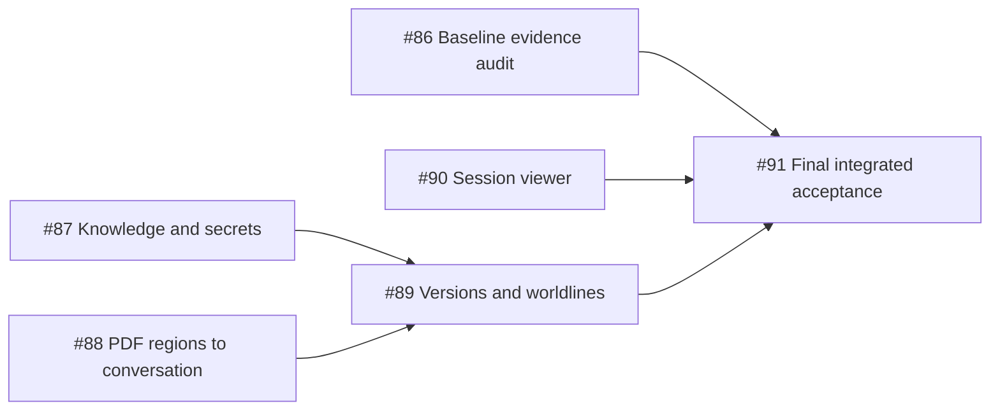

# Session Maps Ticket Plan

Status: partially implemented, not fully accepted. Updated 2026-09-13 against committed code through `8106f8477`, the original six tickets and retained App evidence. This replaces the old planning-only handoff and the premature "implementation complete" status.

Parent: [#85](https://github.com/Leehow/chatrpgv4/issues/85). Specification: [session-maps.md](session-maps.md). Evidence and installed-package history: [handoff-session-maps-pdf-20260913.md](../handoff-session-maps-pdf-20260913.md).

The user will assign other AIs. This update does not launch workers, run a campaign, package, change provider settings or alter game/source state. Keep the six existing issue identities and their original acceptance criteria.

**Tracker synchronization is pending.** GitHub reads began returning EOF before any remote write, including a REST fallback and a one-request proxy-independent check. No remote issue body, label, assignee or native dependency was changed. The local tickets below contain the complete updated issue bodies and are ready to hand to other AIs. Remote #85–#91 remain open with their original blocking links until synchronization succeeds.

| Local assignment file | Existing remote ticket |
| --- | --- |
| [86 — Built-in baseline audit](session-maps-tickets/86-built-in-baseline.md) | [#86](https://github.com/Leehow/chatrpgv4/issues/86) |
| [87 — Knowledge and secret reveal](session-maps-tickets/87-knowledge-reveal.md) | [#87](https://github.com/Leehow/chatrpgv4/issues/87) |
| [88 — PDF regions to conversation](session-maps-tickets/88-pdf-map-publication.md) | [#88](https://github.com/Leehow/chatrpgv4/issues/88) |
| [89 — Source compatibility and history](session-maps-tickets/89-source-history.md) | [#89](https://github.com/Leehow/chatrpgv4/issues/89) |
| [90 — Session viewer](session-maps-tickets/90-session-viewer.md) | [#90](https://github.com/Leehow/chatrpgv4/issues/90) |
| [91 — Integrated acceptance](session-maps-tickets/91-integrated-acceptance.md) | [#91](https://github.com/Leehow/chatrpgv4/issues/91) |

## Assignment Frontier

| Priority / ticket | Work remaining | Depends on for completion | Suggested ownership |
| --- | --- | --- | --- |
| Baseline audit: [#86](https://github.com/Leehow/chatrpgv4/issues/86) | Reconcile retained built-in proof with the original checklist; fill only missing narrow replay/access/failure checks | None | Reviewer/integrator; reuse existing evidence |
| First implementation priority: [#88](https://github.com/Leehow/chatrpgv4/issues/88) | Focused PDF read -> meaningful separate regions -> reviewed publication -> actual partial conversation image | None; implemented #86 baseline is available | PDF reader/publication owner; coordinate existing reader edits |
| Parallel: [#87](https://github.com/Leehow/chatrpgv4/issues/87) | Real observation, limited-plan knowledge and later secret-region disclosure; repair proven semantic/transaction seams | None; implemented #86 baseline is available | Knowledge/admission owner; use built-in prepared sources |
| Parallel: [#90](https://github.com/Leehow/chatrpgv4/issues/90) | Multi-map identity, known-only levels, practical pan/reopen and failure-state UI acceptance | None; implemented #86 baseline is available | Conversation/viewer owner |
| Continuity: [#89](https://github.com/Leehow/chatrpgv4/issues/89) | Source-geometry compatibility, old/current views and worldline fork/switch/merge | #87 and #88 | State/history owner after shared shape is stable |
| Final gate: [#91](https://github.com/Leehow/chatrpgv4/issues/91) | Integrate all original stories, built-in and fresh-PDF real play, actual UI and final package verification | #86, #89 and #90 | One integrator and one live acceptance owner |

#86's implementation has already supplied the prerequisite used by #87/#88/#90. Its remaining evidence reconciliation should not block their work. The updated local plan therefore removes those three blockers and makes #86's residual audit a final prerequisite of #91. #89 still depends on #87/#88, and #91 still depends on #89/#90. This changes scheduling, not acceptance requirements. Apply these native dependency changes only when tracker synchronization is available; they have not yet been made remotely.

`ready-for-agent` means the ticket is specified, not that its blockers have completed or a worker has been assigned. No assignees are added. Keep all six open until their remaining acceptance items are supported.

## Current Workspace and Coordination

- Integration branch: `codex/session-maps`, based on the current TypeScript product tree. Begin from current HEAD, not the obsolete `3ee1e4b0` planning baseline or old Python branches.
- At the start of this update, `extensions/module/reading-service.ts` and `tests/extension/reading-service.test.mjs` had concurrent uncommitted changes. Their owner committed them as `219081f9a` during the reconciliation, together with its contract note. This planning task did not edit or stage those files. #88 must inspect that repair and recheck live ownership before further edits.
- Later in this update, the owner committed the recovery changes in `extensions/kernel/index.ts` and `tests/extension/turn.test.mjs` as `8106f8477`, together with its contract note. This planning task did not edit or stage those files. Recheck live ownership before further edits.
- Suggested file ownership is a starting point, not permission to overwrite: #88 owns reader/review/publication paths; #87 owns semantic map disclosure and admission; #90 owns conversation map UI; #89 owns compatibility/history. Shared contract changes require a single integrator.
- Do not have multiple AIs operate the same App/session/campaign at once. Use separate working copies under the required lifecycle policy for independent coding; preserve every existing save and failed run.
- Default to economical models for routine work. Astra was authorized for core escalation; do not make it the default for every slice.
- Existing tests, real play, visible UI and signed installed-App evidence are distinct. No queued/running job, file count or test count closes a player-visible requirement.

## Established Baseline

- `9bc885f7`: semantic map regions, `apply map`, canonical knowledge/labels, host-only flattened derivatives and conversation cards.
- Built-in App campaign `game-dab0f988-1145-4f89-a4ba-72fbeb89e73a`: 林默 entered the Corbitt House; only `ground-entry-hall` was delivered with Chinese labels and a 161 KiB PNG. UI opened the card, zoomed 100% to 200%, restarted, and reopened with no telemetry change. This is bounded feature evidence, not a completed campaign or evidence for every advanced disclosure case.
- During that run Grok temporarily served the admission lane after OpenCode Go returned `MissingSessionID`; the Keeper remained the App-selected model. Preserve actual model provenance. #91 must reconcile the canonical real-play requirement rather than relabel prior runs.
- Supporting artifacts: `.coc/playtests/session-maps-20260913/` contains RPC, source and redaction evidence; failed attempts remain and are not positive acceptance.
- `c4a95ec5`: reader filesystem confinement; `b768722c`: navigation-only contact sheets; `8ce029e7`: provider-compatible PDF tool schema.
- `2fe2b3c3`: unknown image capability defaults supported; explicit text-only remains blocked.
- `29c75e15`: bounded failed-read retry and fresh correction after a rejected post-timeout input.
- `a9c8773a`: focus/question-bounded detail and coverage review; ordinary units no longer inherit all observed pages.
- `219081f9a`: an inherited failed-job checkpoint no longer skips the source-based repair read; same-job interrupted attempts can retain their completed read. Two regression cases are included, but no new App acceptance or test execution is claimed by this planning update.
- `8106f8477`: source-wait correction is spent once; second-leg prose uses the normal implicit narrate instead of being dropped indefinitely. The retained evidence identifies the earlier thinking-only symptom as a host delivery failure, correcting its prior provider-only attribution. New installed-App acceptance is still needed.
- Installed candidate was a stable-signed fast repack of `a9c8773a` over full package `29c75e15`. Do not call this a fresh dependency assembly. Later code changes need their own build/package evidence.

Historical test results are in the handoff and worker records. They are not new runs for this reconciliation. The earlier Electron suite matched its 196-known-failure baseline; current acceptance must use the repository's actual baseline runner and cannot add failures to it.

## #86 — Audit and Close the Built-in Baseline

The first source-to-known-region-to-visible-card path exists. Reuse its evidence and current tests; do not reimplement it.

Remaining closure:

- Map each original acceptance item to a retained source/RPC/host/UI artifact and the revision it tested.
- Fill missing exact replay, interrupted/rejected batch, cross-campaign access and missing-source behavior checks at existing interfaces.
- Verify that a missing visual reference cannot expose the original source or undo independently committed game effects.
- Preserve the distinction between locally prepared private Rulebook assets and distributable built-in content.
- Record bounded live proof honestly; leave knowledge-growth, PDF and worldline gates with their owners.

## #87 — Demonstrate Knowledge Growth and Secret Discovery

The semantic region state and redaction mechanism are implemented. The remaining requirement is correct use during investigation.

Remaining closure:

- Observe a room without entering; only established visible geography becomes known.
- Obtain a limited plan; learn exactly its supported layout. Hearing a name, a generic visit or owning a document grants no extra geometry.
- Discover a secret region omitted from the investigator map. Use reviewed correspondence to an alternate source, not assumed image alignment.
- Show the newly discovered region while other secrets and Keeper annotations remain absent from delivered bytes and metadata.
- Retain knowledge after leaving; map viewing must not grant movement, clues, items or live NPC positions.
- Add or repair only systemic gaps demonstrated by those cases; use natural Keeper/player decisions for live evidence.

## #88 — Deliver a Useful PDF Map End to End

This is the main unfinished product path. Cold Harvest is the retained diagnostic sample; its physical pages 17 and 23 contain maps. The selected opening succeeded, but the published graph contains no maps.

Remaining closure:

- Prepare a truly focused production detail task for the current map/arrival use. Verify the task and checkpoint actually selected by the runtime; changing question wording alone is not an acceptance method.
- Prevent navigation/context pages and map labels from expanding the task into all residents, rules and later encounters. Necessary immediate dependencies remain required.
- Verify the `219081f9a` inherited-checkpoint repair in the candidate being tested, then demonstrate a focused repair of the oversized failed draft. Preserve evidence and valid source/review results; do not reimplement that repair or rerun dozens of irrelevant units without checking the actual selected phase.
- Produce independently revealable source-backed subregions. A whole-farm or whole-floor region is insufficient when the investigator only knows part of it. Uncertain geometry remains unavailable.
- Validate source page versus cropped-asset coordinate frames, source identity, depicted places, annotation removal and independent review before publication.
- Show at least one known region in the actual conversation while another sourced region stays unknown; later information can reveal another region through the same path.
- Preserve successful unit results when only another unit failed; do not create another retry/scheduler architecture. Distinguish transport failures, review omissions and source contradictions.
- Verify `8106f8477` in the tested/installed candidate: a source wait/failure leaves visible status and a usable next action. The known thinking-only symptom was caused by repeated host text removal, not demonstrated provider refusal. Do not reimplement the completed source fix or confuse it with separate transport failures.
- Record cold preparation separately from checkpoint/cache reuse. No directory permissions beyond the confined reader source/task boundary; no new parser dependencies.

Diagnostic sample state, refreshed 2026-09-13:

| Job | State | What it proves |
| --- | --- | --- |
| read-12 | completed, generation 3 | Selected PDF opening can be read, reviewed and played |
| read-13 | failed | Detail scope expanded; connection error and omitted review fields |
| read-14 | failed | Oversized repair expanded further; auth/connection/JSON failures |
| read-15 | failed at 11:25:48 UTC | Inherited 45-node/54-claim candidate; repeated timeouts/connection errors; not a successful fresh-scope or segmentation test |

Each of the two maps in the retained draft is still a single whole-map region. These unpublished drafts must not be presented as successful partial-disclosure output.

## #89 — Prove Source Compatibility and Temporal Knowledge

Current state stores region ids and labels; historical cards embed delivery-time bytes, and confluence unions known sets. Those facts alone do not prove compatibility after geometry changes.

Remaining closure:

- Use current publication and state interfaces to exercise same-id region geometry/source changes.
- Specify and verify when a correction is compatible, when re-review/new authorization is required, and what the player sees while it is unavailable. A changed view hash is not an authorization rule.
- Keep old cards byte-stable while current-map reads use the active compatible source and authorized knowledge.
- Verify fork/switch/confluence with different revealed sets and no stale foreign-line image selection.
- Cover independent campaigns, old saves without map state, interrupted writes and idempotent replay.
- Record necessary contract changes before implementation; reuse the existing state/history design.

## #90 — Finish Session Viewing and Local Interaction

The basic card, zoom slider, known-level images and local reopen exist.

Remaining closure:

- Demonstrate two known maps with similar labels retaining separate identities and historical cards.
- Make current-session access discoverable using existing conversation/viewer affordances; avoid a new general map-management subsystem.
- Check usable pan/scroll at zoom, known-only floor selection and no unknown labels in tooltips, accessibility or previews.
- Verify viewing does not invoke a model or change the clock, receipts, RNG or knowledge.
- Exercise unavailable/missing-byte recovery and preserve existing handout behavior and play-language labels.

## #91 — Final Integration and Acceptance

Close only after #86, #89 and #90; #89 carries #87/#88 transitively.

- Reconcile all 35 parent stories against implementation and evidence; reuse applicable existing evidence rather than repeating unrelated suites.
- Demonstrate both built-in and fresh original-PDF production paths. A map-required action after opening must not trigger whole-book preparation.
- Show partial reveal, another actual knowledge gain, continued concealment, a secret area absent from the initial player map, leaving/reopening and restart.
- Include actual App images/interactions plus host/public payload and pixel checks.
- Verify current source, tested revision, package contents, stable signing and exact running App identity. Complete required LaunchServices/Spotlight hygiene; the latest fast repack's registration audit was not recorded and must not be assumed.
- Run the relevant kernel/extension/Electron suites with actual exit codes. Never run two pytest suites together or modify the frozen Python oracle/failure baseline to hide regressions.
- Use the repository's canonical real-play method and main session as sole natural-language player; preserve model/lane provenance. A provider-blocked or bounded attempt is reported as such, not full acceptance.
- Record actual preparation, display and cached reopening latency; Codex's polling/idle delay is separate from product latency. Preserve all failed attempts.

## Scope and Handoff Rules

The existing 35 user stories and the original acceptance checklists remain binding. No tactical VTT, generated geography, new parser stack, Python production path, new public tools, language tables, broad cleanup or unrelated provider refactor is added.

Every implementer hands back: scoped diff/commit, exact tests and exit codes, evidence paths, live UI outcome, missing gates and retained failures. Other people/agents own their work; uncommitted changes are not completion evidence. Tracker status stays open until the owner reconciles the checklist and the integrator accepts the result.

## Tracker Synchronization Handoff

When connectivity returns, first fetch each issue's current body/comments and dependencies to preserve any intervening work. Update parent #85 from the current specification and #86–#91 from the corresponding local assignment body, retaining the original criteria, titles, labels, assignees and six parent-child links. All currently carry ready-for-agent; preserve that triage meaning. Do not close unfinished issues.

Update the native blockers to match the local plan: remove #86 as a blocker of #87/#88/#90; add #86 as a blocker of #91; preserve #89 <- #87/#88 and #91 <- #89/#90. Read back all bodies and native edges, then remove the pending-sync notices from these local files. Native dependency endpoint semantics were checked against the [GitHub issue-dependency documentation](https://docs.github.com/en/rest/issues/issue-dependencies). Pre-update tracker bodies and intermediate drafts are retained in `.tmp/session-maps-ticket-sync-20260913/`; publish from the current committed spec/ticket files, which include the concurrent fixes that arrived after those drafts.
