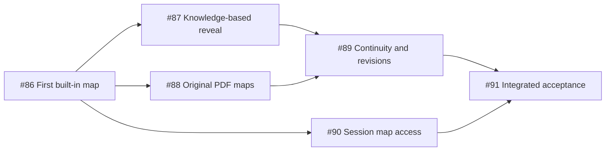

# Session Maps Ticket Plan

Status: implementation complete on `codex/session-maps`; built-in and packaged-App acceptance complete, with the remaining live gates listed below. Source baseline was 0.9.2a at 3ee1e4b0.

## 2026-09-13 Implementation Record

- #86, #87 and #90 are implemented through one path: `apply map` records campaign-scoped semantic regions and player-language labels, `look focus=map` reads known views, the host emits only a confined/redacted flattened derivative, and the mechanics card displays, zooms and switches among known levels.
- #88's production reader path accepts and independently reviews `map_regions`, renders declared source regions, allows a private source only with explicit reviewed redactions, and reuses the same consumer. Real Rulebook pages 453 and 463 were rendered through the production PDF source adapter. A completely fresh PDF semantic-reader run to a playable imported campaign was not performed.
- #89 is implemented by canonical world state, immutable source/view identities, embedded delivery-time derivatives, fresh-campaign isolation, restart recovery and the existing worldline confluence policy. Restart and a second campaign were checked; a live UI worldline merge carrying different map regions was not performed.
- #91 built-in acceptance used a fresh App campaign `game-dab0f988-1145-4f89-a4ba-72fbeb89e73a`. The main session played 林默 through creation, accepted the commission, entered the Corbitt House and asked for only the visible ground-floor entry hall. Grok was the temporary admission reviewer because the configured OpenCode Go reviewer returned `MissingSessionID`; the Keeper remained the App's configured model. The delivered card contained only `ground-entry-hall`, Chinese map/region/level labels, a 161 KiB PNG, no source path and no render geometry. Actual App interaction opened it, zoomed 100% to 200%, restarted the App, reopened the same card with no telemetry change, and retained strict code signing.
- Real-table evidence is preserved in the App's campaign and session stores. Additional deterministic evidence is under `.coc/playtests/session-maps-20260913/`; failed redaction attempts remain present and are not acceptance evidence. The accepted source and UI states were visually inspected.
- Verification: TypeScript kernel typecheck and runtime build pass; map kernel tests 3/3, source/host tests 3/3, map UI tests 2/2, admission and live-extension map seams pass; extension full suite reached 827/827 before the cache fix and 828/829 after it with one unrelated kernel-restart teardown race that passed immediately in isolation; kernel/play full run reached 1251 passed with two expected starter metadata failures, both corrected and rerun 5/5; Electron suite matches its 196-known-failure baseline with no new failures; focused DeepSeek provider and map UI tests pass.
- The live run exposed a packaging defect outside the map path: DeepSeek catalog refresh wrote inside signed App resources. The cache now prefers the writable Pi profile, has a regression test, and the final App remains strictly signed after launch. The old invalid and prior valid bundles are retained as exact recoverable Trash backups.

## Implementation Handoff

- The user has authorized implementation of the six published map tickets. Prefer Sol for routine implementation, investigation and validation; reserve Astra for exceptional, core correctness decisions. This is a task-local cost preference, not a global model or mode change.
- Continue in Default Mode. No worker, separate task, goal, automation, campaign or disposable worktree has been started. The implementation remains in this same Codex task.
- Latest preflight: the shared checkout is on `0.9.2a` at `3ee1e4b08edc1f98fbbd5aa43b33de3248e1a9b5`; only the two planning documents created by this task are untracked. Preserve both documents and recheck live ownership before edits.
- Next: create a task-owned integration checkout through the canonical worktree lifecycle helper, preserving these task-owned planning documents; read the relevant current kernel/host contracts; define the smallest map contract first; implement #86 and then the dependency frontier through #91. Do not stop at planning or at the first code slice.
- Worktree lifecycle policy is `~/.codex/policies/worktree-lifecycle.md`; the `policies/` paths from global instructions resolve there, not to a missing repository directory. Before App build/package/launch, read the corresponding global macOS App hygiene policy.
- Actual source evidence from the preceding investigation remains valid as a starting point: original Rulebook physical pages 452, 453 and 463, reviewed PDF asset publication, missing starter-map bytes, and image handout rows that currently lack an image body. Recheck changed source rather than redoing broad historical research.
- No implementation tests or new real-play acceptance have run. All issue checklists remain pending. Preserve the required real Keeper, sole main-session player and current TypeScript-only production boundaries.

Parent specification: [#85 - Session maps revealed by player knowledge](https://github.com/Leehow/chatrpgv4/issues/85). Local specification: [session-maps.md](session-maps.md).

The user requested planning and ticket decomposition after approving the preceding map design and acceptance criteria. The plan uses the `to-spec` template and `to-tickets` vertical-slice structure. The parent remains a specification umbrella. Implementation is claimed from its unblocked child issues, not by executing the whole parent.

## Intended Outcome

Built-in maps and maps discovered in an original PDF can be shown and reopened in the current conversation. Only the player's established knowledge is visible. Knowledge persists with the campaign while prepared source material can be reused independently. New discoveries, including regions missing from a published investigator map, can extend the visible geography through the same reviewed source and receipt path.

Hollow completion includes registered maps without bytes, files without a usable conversation image, a fully exposed base image behind a frontend overlay, regions revealed solely from scene visits, or passing automated tests without real Keeper and actual UI evidence.

## Vertical Slices

| Slice | Ticket | Blocked by | Independently observable delivery | Parent user stories |
| --- | --- | --- | --- | --- |
| A | [#86 - First built-in map region displayed safely](https://github.com/Leehow/chatrpgv4/issues/86) | None | A real built-in map, a canonical knowledge update, and an actual player-safe conversation image; other pixels and private metadata remain unavailable. | 1, 3, 7, 15, 17, 24-26, 30, 31, 33 |
| B | [#87 - Exploration, observation and acquired plans](https://github.com/Leehow/chatrpgv4/issues/87) | #86 | Real information gains reveal the right regions; naming a place does not reveal its plan; a discovered secret region can appear from a reviewed alternate source. | 9-15, 17, 20, 25, 26 |
| C | [#88 - Demand-read maps from original PDFs](https://github.com/Leehow/chatrpgv4/issues/88) | #86 | A fresh PDF and a later map request use the normal reader/review/publication path and the same session display without preparing all maps upfront. | 2, 24, 27-30, 32, 33 |
| D | [#89 - Resume, worldlines and source revisions](https://github.com/Leehow/chatrpgv4/issues/89) | #87, #88 | Built-in and PDF maps reopen with correct knowledge across restart, campaigns, historical views, existing worldline operations and source updates. | 16, 21-23, 31, 32, 34 |
| E | [#90 - Reopen known maps and floors in the session](https://github.com/Leehow/chatrpgv4/issues/90) | #86 | Players can request or directly reopen known maps, zoom/pan and select known maps or floors without a new model turn or state change. | 3-6, 8, 18, 19, 24 |
| F | [#91 - Integrated real-table and UI acceptance](https://github.com/Leehow/chatrpgv4/issues/91) | #89, #90 | Both a real built-in campaign and a fresh-PDF campaign meet the parent outcome with actual PipiCOC image, state, source and disclosure evidence. | 1-3, 7, 13, 14, 16, 21-24, 28, 33, 35 |

All 35 parent user stories are covered. Every child carries its own acceptance checklist and textual blockers. GitHub also records six native sub-issue links and seven native blocking edges.

## Dependency Graph

Only #86 is initially unblocked. Once it is complete, #87, #88 and #90 become eligible; implementation ownership and conflicting changes still have to be checked. #89 requires both the richer knowledge behavior and the PDF producer because it verifies temporal and source-version behavior across both. #90 depends only on the common projection established by #86; it need not wait for either later producer. #91's dependencies transitively cover all implementation slices.

`ready-for-agent` means the issue is sufficiently specified. Actual execution readiness also requires completed native blockers, no competing owner and a compatible checkout. Publishing these issues does not start a worker, a goal, a campaign or a deployment.

## Constraints From the First Slice

- Contract-first work belongs inside #86's complete vertical slice. The canonical kernel RPC contract records the common source/region representation, mutation, projection, receipt, view identity and errors before implementation. A contract document by itself cannot close #86.
- Production maintenance is confined to the current TypeScript kernel, host runtime, Pi extensions and PipiCOC/Electron wiring. Retired Python code, historical worktrees and old parser implementations are not recovery or development inputs.
- The shared map module hides rendering and source variant complexity behind the existing semantic tools and host projection. Built-in and PDF producers conform to one contract.
- Kernel transactions own knowledge changes. The Keeper judges meaning. Source readers and reviewers ground maps. The host restricts outgoing image bytes. The conversation displays and reopens the result.
- Secrecy, actual bytes, atomicity, basic persistence, campaign isolation and idempotency are mandatory in #86. #89 extends and verifies complex continuity; it does not grant earlier slices permission to defer these properties.
- A failed visual-reference update never reveals the original image. A source-fact deficiency that blocks a game action still uses the existing material-before-effects gate.
- A map card is a spatial reference. It does not by itself grant movement, discover a clue or create a physical document. Direct viewing never creates a synthetic Keeper turn.
- Original source map lettering and authored physical documents remain intact. Added public labels and interface text use the existing open play-language mechanism.
- Implementation must preserve unrelated concurrent work and all campaign, source and acceptance evidence. This plan grants no Git push, destructive cleanup or deployment authority.

## Verification and Completion Gates

1. Each implementation ticket verifies a narrow complete behavior through existing RPC, source/publication, host asset and conversation interfaces. Tests target the observable result rather than mirroring helper functions.
2. Each slice retains the real-play and display evidence required by its checklist. Bound the local feature inspection honestly; never promote a bounded inspection into a completed campaign.
3. The final gate uses the canonical setup/play driver with Grok as Keeper and the main session as the sole player, one natural utterance at a time, through a natural ending or real blocker. A fresh PDF must use the production reader; no manually inserted map records, fake Keeper or scripted player is admissible.
4. Actual PipiCOC images and viewer interactions are checked in addition to receipts and source records. Unknown pixels, labels, geometry and source URLs are checked at the player-facing host interfaces, not merely hidden in a screenshot.
5. Cover real built-in map bytes, fresh PDF discovery, later-demand preparation, partial disclosure, knowledge without entry, a secret region missing from the initial investigator map, revisiting, resume, separate campaigns and temporal view identity. Use supporting interface tests for rare controlled failure/version cases and report their evidence category.
6. Before any macOS build, package or App launch, apply the repository's App hygiene policy and verify the exact canonical runtime. Source, automated tests, real play, actual UI and packaged-App evidence remain separate claims.
7. Run the required kernel, extension and Electron checks with actual exit codes. No concurrent pytest suites, new known-failure baseline entries or modifications to the historical Python oracle.
8. Record cold preparation, reveal/display and cached reopening latency. Reopening an existing view must use no model call. Record failures and unrun gates plainly; retain every attempt.

No code, tests, runtime configuration or existing campaign state was changed by this planning task. The parent and child issues remain open; creation is not implementation completion.
